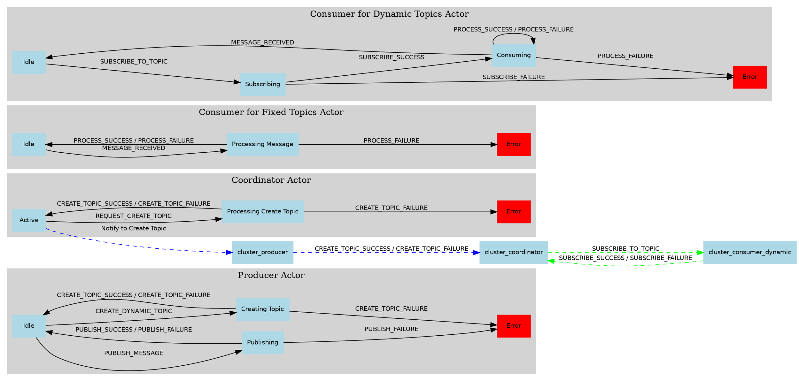

# Data Platform: A Dynamic Topic Management System

```dot
digraph DataStreamModel {
    rankdir=LR;
    node [shape=rectangle, style=filled, color=lightblue, fontname=Helvetica, fontsize=10];
    edge [fontname=Helvetica, fontsize=10];

    // ------------------------ Producer Actor ------------------------
    subgraph cluster_producer {
        label="Producer Actor";
        style=filled;
        color=lightgrey;

        Producer_idle [label="Idle"];
        Producer_publishing [label="Publishing"];
        Producer_creatingTopic [label="Creating Topic"];
        Producer_error [label="Error", color=red];

        Producer_idle -> Producer_publishing [label="PUBLISH_MESSAGE"];
        Producer_idle -> Producer_creatingTopic [label="CREATE_DYNAMIC_TOPIC"];
        
        Producer_publishing -> Producer_idle [label="PUBLISH_SUCCESS / PUBLISH_FAILURE"];
        Producer_creatingTopic -> Producer_idle [label="CREATE_TOPIC_SUCCESS / CREATE_TOPIC_FAILURE"];
        Producer_publishing -> Producer_error [label="PUBLISH_FAILURE"];
        Producer_creatingTopic -> Producer_error [label="CREATE_TOPIC_FAILURE"];
    }

    // ------------------------ Coordinator Actor ------------------------
    subgraph cluster_coordinator {
        label="Coordinator Actor";
        style=filled;
        color=lightgrey;

        Coordinator_active [label="Active"];
        Coordinator_processingCreateTopic [label="Processing Create Topic"];
        Coordinator_error [label="Error", color=red];

        Coordinator_active -> Coordinator_processingCreateTopic [label="REQUEST_CREATE_TOPIC"];
        Coordinator_processingCreateTopic -> Coordinator_active [label="CREATE_TOPIC_SUCCESS / CREATE_TOPIC_FAILURE"];
        Coordinator_processingCreateTopic -> Coordinator_error [label="CREATE_TOPIC_FAILURE"];
    }

    // ------------------------ Consumer Fixed Actor ------------------------
    subgraph cluster_consumer_fixed {
        label="Consumer for Fixed Topics Actor";
        style=filled;
        color=lightgrey;

        ConsumerFixed_idle [label="Idle"];
        ConsumerFixed_processingMessage [label="Processing Message"];
        ConsumerFixed_error [label="Error", color=red];

        ConsumerFixed_idle -> ConsumerFixed_processingMessage [label="MESSAGE_RECEIVED"];
        ConsumerFixed_processingMessage -> ConsumerFixed_idle [label="PROCESS_SUCCESS / PROCESS_FAILURE"];
        ConsumerFixed_processingMessage -> ConsumerFixed_error [label="PROCESS_FAILURE"];
    }

    // ------------------------ Consumer Dynamic Actor ------------------------
    subgraph cluster_consumer_dynamic {
        label="Consumer for Dynamic Topics Actor";
        style=filled;
        color=lightgrey;

        ConsumerDynamic_idle [label="Idle"];
        ConsumerDynamic_subscribing [label="Subscribing"];
        ConsumerDynamic_consuming [label="Consuming"];
        ConsumerDynamic_error [label="Error", color=red];

        ConsumerDynamic_idle -> ConsumerDynamic_subscribing [label="SUBSCRIBE_TO_TOPIC"];
        ConsumerDynamic_subscribing -> ConsumerDynamic_consuming [label="SUBSCRIBE_SUCCESS"];
        ConsumerDynamic_subscribing -> ConsumerDynamic_error [label="SUBSCRIBE_FAILURE"];
        ConsumerDynamic_consuming -> ConsumerDynamic_idle [label="MESSAGE_RECEIVED"];
        ConsumerDynamic_consuming -> ConsumerDynamic_consuming [label="PROCESS_SUCCESS / PROCESS_FAILURE"];
        ConsumerDynamic_consuming -> ConsumerDynamic_error [label="PROCESS_FAILURE"];
    }

    // ------------------------ Interactions ------------------------
    // Coordinator interacts with Producer
    Coordinator_active -> cluster_producer [label="Notify to Create Topic", color=blue, style=dashed];
    cluster_producer -> cluster_coordinator [label="CREATE_TOPIC_SUCCESS / CREATE_TOPIC_FAILURE", color=blue, style=dashed];

    // Coordinator instructs Consumer Dynamic to Subscribe
    cluster_coordinator -> cluster_consumer_dynamic [label="SUBSCRIBE_TO_TOPIC", color=green, style=dashed];
    cluster_consumer_dynamic -> cluster_coordinator [label="SUBSCRIBE_SUCCESS / SUBSCRIBE_FAILURE", color=green, style=dashed];
}


```