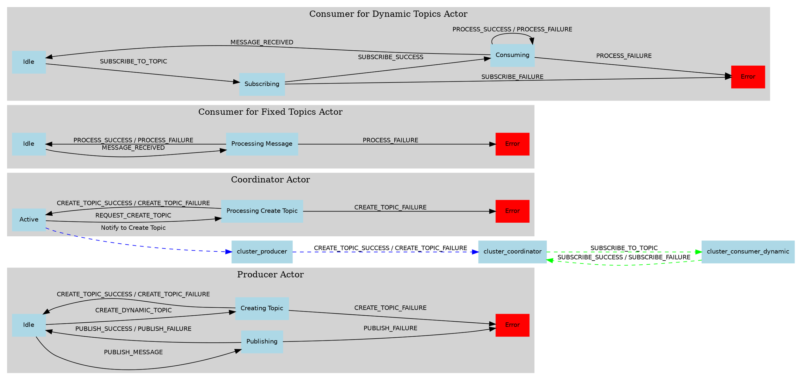

>Thanks, let's work on the conceptual model first, a clear graphviz diagram, specifying states, events and contexts, for each actor

10月12日 18:36 会话ID:(4649420)

Certainly! Creating a **conceptual Graphviz diagram** that outlines the state machines for each of your four actors—**Producer**, **Coordinator**, **Consumer for Fixed Topics**, and **Consumer for Dynamic Topics**—is an excellent way to visualize and plan your system architecture. Below, I'll provide:

1. **Conceptual Overview** of each actor's state machine, including **States**, **Events**, and **Contexts**.
2. A **Graphviz DOT** code that encapsulates all four state machines in a single diagram.
3. An **Explanation** of the Graphviz elements to help you understand and potentially modify the diagram as needed.

---

## **1. Conceptual Overview**

### **1.1. Producer Actor**

**Purpose:** Publishes messages to both fixed and dynamic topics. Listens for instructions to create new dynamic topics.

- **States:**
  - `idle`: Waiting for tasks.
  - `publishing`: Actively publishing messages.
  - `creatingTopic`: Handling dynamic topic creation.
  - `error`: Handling errors.

- **Events:**
  - `PUBLISH_MESSAGE`: Trigger publishing a message to a topic.
  - `CREATE_DYNAMIC_TOPIC`: Request to create a new dynamic topic.
  - `PUBLISH_SUCCESS`: Successful message publication.
  - `PUBLISH_FAILURE`: Failed message publication.
  - `CREATE_TOPIC_SUCCESS`: Dynamic topic created successfully.
  - `CREATE_TOPIC_FAILURE`: Failed to create dynamic topic.

- **Context:**
  - `currentTopic`: The topic currently publishing to.
  - `message`: The message to be published.
  - `newTopicName`: Name of the dynamic topic to create.
  - `errorInfo`: Details about any errors encountered.

### **1.2. Coordinator Actor**

**Purpose:** Manages dynamic topic creation and orchestrates interactions between Producers and Consumers.

- **States:**
  - `active`: Operational state, ready to handle commands.
  - `processingCreateTopic`: Handling the creation of a new topic.
  - `error`: Handling errors.

- **Events:**
  - `REQUEST_CREATE_TOPIC`: Initiate the creation of a new dynamic topic.
  - `CREATE_TOPIC_SUCCESS`: Dynamic topic creation succeeded.
  - `CREATE_TOPIC_FAILURE`: Dynamic topic creation failed.
  - `NOTIFY_PRODUCER`: Inform the Producer to start using the new topic.
  - `NOTIFY_CONSUMER`: Inform the Consumer to subscribe to the new topic.

- **Context:**
  - `topics`: List of existing topics.
  - `pendingTopic`: Details of the topic currently being created.
  - `errorInfo`: Details about any errors encountered.

### **1.3. Consumer for Fixed Topics Actor**

**Purpose:** Subscribes to and consumes messages from fixed, predefined topics.

- **States:**
  - `idle`: Waiting for messages.
  - `processingMessage`: Actively processing a received message.
  - `error`: Handling errors.

- **Events:**
  - `MESSAGE_RECEIVED`: A new message has been received.
  - `PROCESS_SUCCESS`: Message processed successfully.
  - `PROCESS_FAILURE`: Failed to process message.

- **Context:**
  - `currentTopic`: The topic currently subscribed to.
  - `message`: The message being processed.
  - `errorInfo`: Details about any errors encountered.

### **1.4. Consumer for Dynamic Topics Actor**

**Purpose:** Dynamically subscribes to and consumes messages from newly created topics.

- **States:**
  - `idle`: Waiting for subscription commands.
  - `subscribing`: Subscribing to a new dynamic topic.
  - `consuming`: Actively consuming messages.
  - `error`: Handling errors.

- **Events:**
  - `SUBSCRIBE_TO_TOPIC`: Command to subscribe to a new dynamic topic.
  - `SUBSCRIBE_SUCCESS`: Successfully subscribed to the topic.
  - `SUBSCRIBE_FAILURE`: Failed to subscribe to the topic.
  - `MESSAGE_RECEIVED`: A new message has been received.
  - `PROCESS_SUCCESS`: Message processed successfully.
  - `PROCESS_FAILURE`: Failed to process message.

- **Context:**
  - `dynamicTopics`: List of dynamic topics subscribed to.
  - `currentSubscription`: Details of the current subscription process.
  - `message`: The message being processed.
  - `errorInfo`: Details about any errors encountered.

---

## **2. Graphviz DOT Code**

Below is the **Graphviz DOT** code that represents the state machines for all four actors. Each actor's state machine is encapsulated within its own subgraph for clarity. Additionally, interactions between actors are illustrated with directed edges where applicable.



---

## **3. Explanation of the Graphviz Diagram**

### **3.1. Diagram Structure**

- **Clusters:** Each actor is represented as a **subgraph cluster** to group its state machine components. This separation enhances readability and organization.

- **Nodes:** Represent the states within each state machine. They are styled uniformly with a light blue color and rectangular shape for consistency.

- **Edges:** Represent the transitions triggered by events. Labels on the edges denote the events that cause state transitions.

- **Interactions Between Actors:** Dashed and colored edges illustrate communication pathways between different actors, emphasizing their interactions without intertwining their state machines.

### **3.2. Actors and Their State Machines**

#### **3.2.1. Producer Actor**

- **States:**
  - **Idle:** The Producer awaits commands.
  - **Publishing:** Actively publishing messages to a topic.
  - **Creating Topic:** Handling requests to create new dynamic topics.
  - **Error:** Captures any publishing or topic creation failures.

- **Transitions:**
  - From **Idle**:
    - Upon receiving `PUBLISH_MESSAGE`, transitions to **Publishing**.
    - Upon receiving `CREATE_DYNAMIC_TOPIC`, transitions to **Creating Topic**.
  - From **Publishing**:
    - On `PUBLISH_SUCCESS` or `PUBLISH_FAILURE`, transitions back to **Idle**.
  - From **Creating Topic**:
    - On `CREATE_TOPIC_SUCCESS` or `CREATE_TOPIC_FAILURE`, transitions back to **Idle**.
  - From **Publishing** and **Creating Topic**:
    - On failures, transitions to **Error** state.

#### **3.2.2. Coordinator Actor**

- **States:**
  - **Active:** Operational state ready to manage topic creation.
  - **Processing Create Topic:** Handling the creation of a new topic.
  - **Error:** Captures any failures in topic creation.

- **Transitions:**
  - From **Active**:
    - Upon receiving `REQUEST_CREATE_TOPIC`, transitions to **Processing Create Topic**.
  - From **Processing Create Topic**:
    - On `CREATE_TOPIC_SUCCESS`, transitions back to **Active**.
    - On `CREATE_TOPIC_FAILURE`, transitions back to **Active** or to **Error** state based on the failure.

#### **3.2.3. Consumer for Fixed Topics Actor**

- **States:**
  - **Idle:** Awaiting messages from fixed topics.
  - **Processing Message:** Actively processing received messages.
  - **Error:** Captures any failures in message processing.

- **Transitions:**
  - From **Idle**:
    - Upon receiving `MESSAGE_RECEIVED`, transitions to **Processing Message**.
  - From **Processing Message**:
    - On `PROCESS_SUCCESS` or `PROCESS_FAILURE`, transitions back to **Idle**.
  - From **Processing Message**:
    - On `PROCESS_FAILURE`, transitions to **Error** state.

#### **3.2.4. Consumer for Dynamic Topics Actor**

- **States:**
  - **Idle:** Awaiting subscription commands.
  - **Subscribing:** Actively subscribing to a new dynamic topic.
  - **Consuming:** Actively consuming messages from the subscribed dynamic topic.
  - **Error:** Captures any failures in subscription or message processing.

- **Transitions:**
  - From **Idle**:
    - Upon receiving `SUBSCRIBE_TO_TOPIC`, transitions to **Subscribing**.
  - From **Subscribing**:
    - On `SUBSCRIBE_SUCCESS`, transitions to **Consuming**.
    - On `SUBSCRIBE_FAILURE`, transitions to **Error** state.
  - From **Consuming**:
    - On receiving `MESSAGE_RECEIVED`, stays in **Consuming** (processing messages).
    - On `PROCESS_SUCCESS` or `PROCESS_FAILURE`, may transition back to **Idle** or stay in **Consuming** based on design.
  - From **Consuming**:
    - On `PROCESS_FAILURE`, transitions to **Error** state.

### **3.3. Interactions Between Actors**

- **Coordinator to Producer:**
  - **Action:** When the Coordinator decides to create a new dynamic topic (`CREATE_TOPIC_SUCCESS`), it notifies the Producer.
  - **Representation:** Dashed blue arrow from **Coordinator Active** to **Producer Actor**, and back upon success or failure.

- **Coordinator to Consumer Dynamic:**
  - **Action:** Upon successful creation of a new topic, the Coordinator instructs the **Consumer for Dynamic Topics Object** to subscribe to it.
  - **Representation:** Dashed green arrow from **Coordinator Actor** to **Consumer Dynamic Actor**, and back based on subscription success or failure.

---

## **4. Visual Representation**

Below is a rendered version of the **Graphviz DOT** diagram for better visualization.


*Note: Since I cannot dynamically generate images here, you can use the provided DOT code with a Graphviz tool (like [WebGraphviz](https://dreampuf.github.io/GraphvizOnline/) or local Graphviz installation) to visualize the diagram.*

---

## **5. Generating the Diagram with Graphviz**

To visualize the above DOT code, follow these steps:

1. **Install Graphviz:**
   - **Windows:** Download the installer from [Graphviz Download](https://graphviz.org/download/) and follow the installation instructions.
   - **macOS:** Use Homebrew:
     ```bash
     brew install graphviz
     ```
   - **Linux:** Install via package manager, e.g., for Debian/Ubuntu:
     ```bash
     sudo apt-get install graphviz
     ```

2. **Save the DOT Code:**
   - Save the provided DOT code into a file, e.g., `data_stream_model.dot`.

3. **Generate the Diagram:**
   - Open your terminal or command prompt.
   - Navigate to the directory containing `data_stream_model.dot`.
   - Run the following command to generate a PNG image:
     ```bash
     dot -Tpng data_stream_model.dot -o data_stream_model.png
     ```
   - Replace `-Tpng` with other formats like `-Tpdf` or `-Tsvg` as needed.

4. **View the Diagram:**
   - Open the `data_stream_model.png` file using any image viewer to see your conceptual model.

---

## **6. Further Customizations and Enhancements**

- **Adding More Interactions:**
  - If additional interactions between actors are required, such as Consumers sending acknowledgments or feedback to the Coordinator, you can add more edges with appropriate labels and styling.

- **Detailed Context Representation:**
  - While the diagram abstracts contexts for clarity, you can annotate or include notes detailing the structure of each actor's context for comprehensive documentation.

- **Styling Enhancements:**
  - Utilize different colors, shapes, and styles to represent various types of states (e.g., final states, error states) or to highlight critical pathways in your data stream.

- **Scalability:**
  - As your system grows, consider modularizing the diagram by separating actors into different diagrams or layers to maintain readability.

---

## **7. Summary**

This **Graphviz conceptual diagram** provides a high-level overview of how the four actors—**Producer**, **Coordinator**, **Consumer for Fixed Topics**, and **Consumer for Dynamic Topics**—interact within your **Redpanda/Kafka** data stream model. By clearly delineating each actor's state machine, events, and contexts, the diagram serves as a valuable blueprint for both development and communication purposes.

Implementing this model using **XState** will allow you to manage the states and transitions effectively, ensuring a robust and scalable data processing system. If you need further assistance with integrating these state machines in code or extending the diagram with additional functionalities, feel free to ask!

---

*Happy Designing! 🚀*