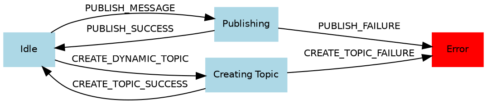
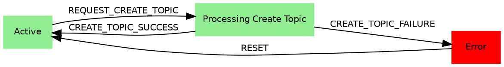
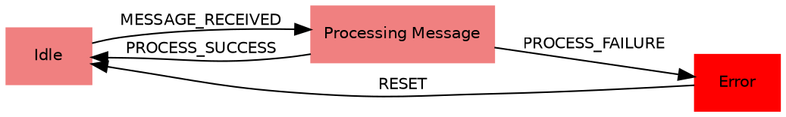
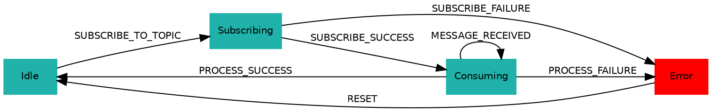
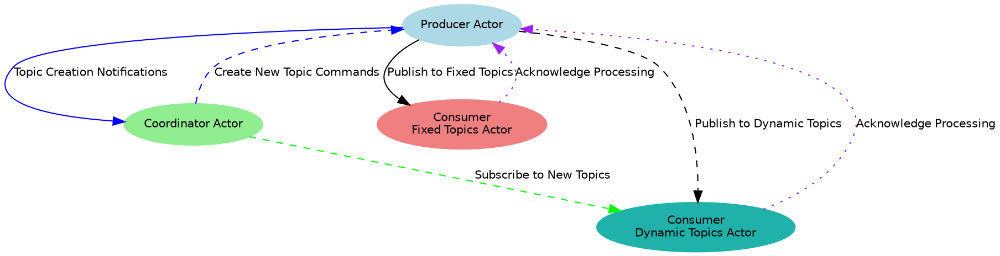

>how about graphviz diagram for each actor

10月12日 18:38 会话ID:(4649420)

Certainly! Creating **Graphviz** diagrams for each of your four actors—**Producer**, **Coordinator**, **Consumer for Fixed Topics**, and **Consumer for Dynamic Topics**—will provide a clear visual representation of their respective state machines. Below, you'll find detailed **Graphviz DOT** code for each actor, along with explanations of their states, events, and contexts.

---

## **1. Producer Actor**

### **1.1. Conceptual Overview**

**Producer Actor** is responsible for publishing messages to both fixed and dynamic topics. It listens for commands to create new dynamic topics and manages message publishing accordingly.

- **States:**
  - `idle`: Waiting for tasks.
  - `publishing`: Actively publishing messages.
  - `creatingTopic`: Handling dynamic topic creation.
  - `error`: Handling errors.

- **Events:**
  - `PUBLISH_MESSAGE`: Command to publish a message to a topic.
  - `CREATE_DYNAMIC_TOPIC`: Command to create a new dynamic topic.
  - `PUBLISH_SUCCESS`: Successful message publication.
  - `PUBLISH_FAILURE`: Failed message publication.
  - `CREATE_TOPIC_SUCCESS`: Dynamic topic created successfully.
  - `CREATE_TOPIC_FAILURE`: Failed to create dynamic topic.

- **Context:**
  - `currentTopic`: The topic currently publishing to.
  - `message`: The message to be published.
  - `newTopicName`: Name of the dynamic topic to create.
  - `errorInfo`: Details about any errors encountered.

### **1.2. Graphviz Diagram**



### **1.3. Diagram Explanation**

- **Nodes:**
  - **Idle:** The producer awaits incoming tasks, such as publishing messages or creating topics.
  - **Publishing:** The producer is currently sending messages to a specified topic.
  - **Creating Topic:** The producer is handling the creation of a new dynamic topic.
  - **Error:** An error occurred either during message publishing or topic creation.

- **Edges (Transitions):**
  - From **Idle**:
    - `PUBLISH_MESSAGE` triggers a transition to **Publishing**.
    - `CREATE_DYNAMIC_TOPIC` triggers a transition to **Creating Topic**.
  
  - From **Publishing**:
    - `PUBLISH_SUCCESS` transitions back to **Idle** upon successful message publication.
    - `PUBLISH_FAILURE` transitions to **Error** if message publishing fails.
  
  - From **Creating Topic**:
    - `CREATE_TOPIC_SUCCESS` transitions back to **Idle** upon successful topic creation.
    - `CREATE_TOPIC_FAILURE` transitions to **Error** if topic creation fails.

---

## **2. Coordinator Actor**

### **2.1. Conceptual Overview**

**Coordinator Actor** manages the overall coordination of dynamic topic creation and orchestrates interactions between Producers and Consumers. It handles control messages that dictate dynamic topic management.

- **States:**
  - `active`: Operational state, ready to handle commands.
  - `processingCreateTopic`: Handling the creation of a new topic.
  - `error`: Handling errors.

- **Events:**
  - `REQUEST_CREATE_TOPIC`: Initiate the creation of a new dynamic topic.
  - `CREATE_TOPIC_SUCCESS`: Dynamic topic creation succeeded.
  - `CREATE_TOPIC_FAILURE`: Dynamic topic creation failed.
  - `NOTIFY_PRODUCER`: Inform Producer to start using the new topic.
  - `NOTIFY_CONSUMER`: Inform Consumer to subscribe to the new topic.

- **Context:**
  - `topics`: List of existing topics.
  - `pendingTopic`: Details of the topic currently being created.
  - `errorInfo`: Details about any errors encountered.

### **2.2. Graphviz Diagram**



### **2.3. Diagram Explanation**

- **Nodes:**
  - **Active:** The coordinator is operational and ready to handle incoming commands.
  - **Processing Create Topic:** The coordinator is in the process of creating a new dynamic topic.
  - **Error:** An error occurred during topic creation.

- **Edges (Transitions):**
  - From **Active**:
    - `REQUEST_CREATE_TOPIC` triggers a transition to **Processing Create Topic**.
  
  - From **Processing Create Topic**:
    - `CREATE_TOPIC_SUCCESS` transitions back to **Active** upon successful topic creation.
    - `CREATE_TOPIC_FAILURE` transitions to **Error** if topic creation fails.
  
  - From **Error**:
    - `RESET` transitions back to **Active**, allowing for retry mechanisms or alternative handling.

---

## **3. Consumer for Fixed Topics Actor**

### **3.1. Conceptual Overview**

**Consumer for Fixed Topics Actor** subscribes to and consumes messages from predefined (fixed) topics. It processes incoming messages and handles any processing outcomes.

- **States:**
  - `idle`: Waiting for messages.
  - `processingMessage`: Actively processing a received message.
  - `error`: Handling errors.

- **Events:**
  - `MESSAGE_RECEIVED`: A new message has been received.
  - `PROCESS_SUCCESS`: Message processed successfully.
  - `PROCESS_FAILURE`: Failed to process message.

- **Context:**
  - `currentTopic`: The topic currently subscribed to.
  - `message`: The message being processed.
  - `errorInfo`: Details about any errors encountered.

### **3.2. Graphviz Diagram**



### **3.3. Diagram Explanation**

- **Nodes:**
  - **Idle:** The consumer awaits incoming messages on fixed topics.
  - **Processing Message:** The consumer is actively processing a received message.
  - **Error:** An error occurred during message processing.

- **Edges (Transitions):**
  - From **Idle**:
    - `MESSAGE_RECEIVED` triggers a transition to **Processing Message**.
  
  - From **Processing Message**:
    - `PROCESS_SUCCESS` transitions back to **Idle** upon successful message processing.
    - `PROCESS_FAILURE` transitions to **Error** if message processing fails.
  
  - From **Error**:
    - `RESET` transitions back to **Idle**, allowing for retry mechanisms or alternative handling.

---

## **4. Consumer for Dynamic Topics Actor**

### **4.1. Conceptual Overview**

**Consumer for Dynamic Topics Actor** dynamically subscribes to newly created topics based on coordination. It handles message consumption from these dynamic topics and manages dynamic subscriptions.

- **States:**
  - `idle`: Waiting for subscription commands.
  - `subscribing`: Subscribing to a new dynamic topic.
  - `consuming`: Actively consuming messages from dynamic topics.
  - `error`: Handling errors.

- **Events:**
  - `SUBSCRIBE_TO_TOPIC`: Command to subscribe to a new dynamic topic.
  - `SUBSCRIBE_SUCCESS`: Successfully subscribed to the topic.
  - `SUBSCRIBE_FAILURE`: Failed to subscribe to the topic.
  - `MESSAGE_RECEIVED`: A new message has been received.
  - `PROCESS_SUCCESS`: Message processed successfully.
  - `PROCESS_FAILURE`: Failed to process message.

- **Context:**
  - `dynamicTopics`: List of dynamic topics subscribed to.
  - `currentSubscription`: Details of the current subscription process.
  - `message`: The message being processed.
  - `errorInfo`: Details about any errors encountered.

### **4.2. Graphviz Diagram**



### **4.3. Diagram Explanation**

- **Nodes:**
  - **Idle:** The consumer awaits commands to subscribe to new dynamic topics.
  - **Subscribing:** The consumer is in the process of subscribing to a dynamic topic.
  - **Consuming:** The consumer is actively consuming messages from subscribed dynamic topics.
  - **Error:** An error occurred during subscription or message processing.

- **Edges (Transitions):**
  - From **Idle**:
    - `SUBSCRIBE_TO_TOPIC` triggers a transition to **Subscribing**.
  
  - From **Subscribing**:
    - `SUBSCRIBE_SUCCESS` transitions to **Consuming** upon successful subscription.
    - `SUBSCRIBE_FAILURE` transitions to **Error** if subscription fails.
  
  - From **Consuming**:
    - `MESSAGE_RECEIVED` triggers internal handling (e.g., loops back to **Consuming** for each new message).
    - `PROCESS_SUCCESS` transitions back to **Idle** after processing messages.
    - `PROCESS_FAILURE` transitions to **Error** if message processing fails.
  
  - From **Error**:
    - `RESET` transitions back to **Idle**, allowing for retry mechanisms or alternative handling.

---

## **5. Overall System Interaction Diagram (Optional)**

While you requested individual diagrams, it might be beneficial to understand how these actors interact within the system. Below is an **optional** overall interaction diagram that showcases the relationships between the four actors.

### **5.1. Graphviz Diagram**



### **5.2. Diagram Explanation**

- **Actors:**
  - **Producer Actor:** Publishes messages to both fixed and dynamic topics.
  - **Coordinator Actor:** Manages dynamic topic creation and orchestrates consumer subscriptions.
  - **Consumer for Fixed Topics Actor:** Consumes messages from fixed topics.
  - **Consumer for Dynamic Topics Actor:** Consumes messages from dynamically created topics.

- **Data Flow:**
  - **Producer** notifies **Coordinator** about topic-related events.
  - **Coordinator** sends commands to **Producer** to create new dynamic topics.
  - **Producer** publishes messages to both fixed and dynamic topics.
  - **Coordinator** instructs **ConsumerDynamic** to subscribe to newly created topics.
  - **ConsumerFixed** and **ConsumerDynamic** acknowledge processing tasks back to **Producer**.

- **Visual Indicators:**
  - **Solid Lines:** Represent direct data publishing flows.
  - **Dashed Lines:** Represent command or control flows.
  - **Dotted Lines:** Represent acknowledgments or feedback loops.

*Note: This diagram encapsulates the interactions but focuses on illustrating the relationships and data flows among actors.*

---

## **6. Generating the Diagrams**

To generate these diagrams from the provided DOT code:

1. **Install Graphviz:**
   
   - **Windows:** Download the installer from [Graphviz Download](https://graphviz.org/download/) and follow the installation instructions.
   - **macOS:** Use Homebrew:
     ```bash
     brew install graphviz
     ```
   - **Linux:** Install via package manager, e.g., for Debian/Ubuntu:
     ```bash
     sudo apt-get install graphviz
     ```

2. **Save the DOT Code:**
   
   - Save each DOT code block into separate `.dot` files, e.g., `ProducerActor.dot`, `CoordinatorActor.dot`, etc.

3. **Generate the Diagrams:**
   
   - Use the `dot` command to generate images. For example, to generate a PNG for the Producer Actor:
     ```bash
     dot -Tpng ProducerActor.dot -o ProducerActor.png
     ```
   - Repeat the process for each actor.

4. **View the Diagrams:**
   
   - Open the generated `.png` files using your preferred image viewer.

---

## **7. Additional Recommendations**

- **Modularity:** By defining separate state machines for each actor, you ensure that each component is self-contained and easier to maintain.
  
- **Scalability:** This approach allows you to scale individual components without affecting others. For instance, adding more dynamic consumers won't require changes to the Producer or Coordinator state machines.
  
- **Error Handling:** Incorporate robust error handling within each state machine to manage failures gracefully and maintain system stability.
  
- **Logging and Monitoring:** Implement comprehensive logging within actions and services to facilitate debugging and monitoring of state transitions and actor behaviors.

---

## **Conclusion**

By visualizing each actor's state machine using **Graphviz**, you gain a clearer understanding of their roles, states, and interactions within the system. This approach not only aids in system design and documentation but also enhances collaboration among team members by providing a shared visual language.

Feel free to customize the provided DOT codes further to align with your specific project nuances or to incorporate additional states and events as your system evolves. If you have any more questions or need further assistance with **XState**, **Graphviz**, or any other aspect of your project, don't hesitate to ask!

Happy Coding! 🚀