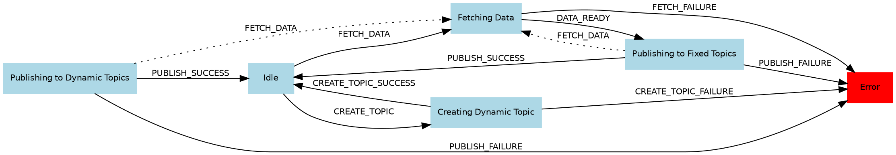
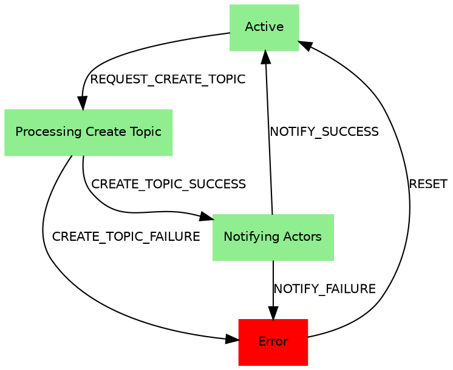
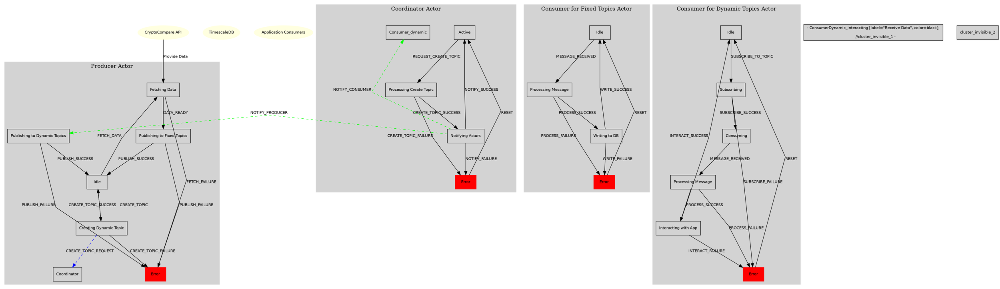
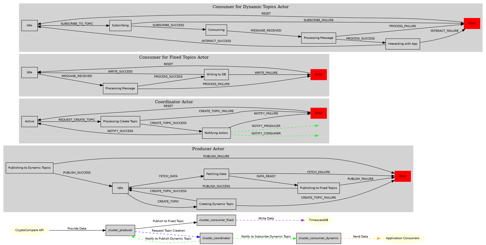

> let's extend this, for producer, data is obtained outside, say cryptocompare, for fixed topic consumer, data push to data base, say timescaledb, for dynamic topic consumers, they are the apps using the data platform.

10 月 12 日 18:49 会话 ID:(4649420)

Absolutely! Extending your conceptual model to incorporate external data sources, databases, and application consumers adds valuable context and aligns your **XState** actors with real-world interactions. Below, I'll provide a comprehensive guide that includes:

1. **Conceptual Architecture Overview**
2. **Individual Graphviz Diagrams for Each Actor**
3. **Explanation of Each Diagram**
4. **Overall System Interaction Diagram**
5. **Recommendations for Implementation**

---

## **1. Conceptual Architecture Overview**

### **1.1. Actors and Their Responsibilities**

1. **Producer Actor**

   - **Source of Data:** Obtains data from external APIs or services (e.g., `[CryptoCompare](https://www.cryptocompare.com/)`).
   - **Fixed Topics:** Publishes processed data to fixed topics that are consumed by backend services.
   - **Dynamic Topics:** Publishes data to dynamically created topics based on runtime requirements, catering to specific application consumers.
   - **Interactions:** Communicates with the **Coordinator Actor** to manage topic creation.

2. **Coordinator Actor**

   - **Dynamic Topic Management:** Handles requests to create or modify dynamic topics.
   - **Orchestration:** Coordinates between producers and consumers to ensure seamless data flow.
   - **Interactions:** Instructs the **Producer Actor** to publish to new topics and spawns **Consumer for Dynamic Topics Actors**.

3. **Consumer for Fixed Topics Actor**

   - **Backend Integration:** Subscribes to fixed topics and pushes incoming data to databases (e.g., `[TimescaleDB](https://www.timescale.com/)`).
   - **Data Persistence:** Ensures reliable storage of incoming data for further analysis or processing.

4. **Consumer for Dynamic Topics Actor**
   - **Application Consumers:** Represents applications or services that utilize the data platform.
   - **Dynamic Subscription:** Subscribes to dynamically created topics to receive tailored data streams.
   - **Scalability:** Allows the system to cater to varying application needs without hardcoding topic subscriptions.

### **1.2. External Systems**

- **External Data Sources:** APIs or services providing real-time data (e.g., CryptoCompare).
- **Database:** Systems like TimescaleDB for persisting data.
- **Application Consumers:** Various applications or services that consume data from dynamic topics.

---

## **2. Individual Graphviz Diagrams for Each Actor**

### **2.1. Producer Actor**

#### **2.1.1. Conceptual Overview**

**Producer Actor** is responsible for fetching data from external sources and publishing it to both fixed and dynamic Kafka/Redpanda topics. It listens for instructions from the **Coordinator Actor** to create new dynamic topics as needed.

- **States:**

  - `idle`: Awaiting data fetch or commands.
  - `fetchingData`: Retrieving data from external sources.
  - `publishingFixed`: Publishing data to fixed topics.
  - `publishingDynamic`: Publishing data to dynamic topics.
  - `creatingTopic`: Handling dynamic topic creation requests.
  - `error`: Handling any errors during operations.

- **Events:**

  - `FETCH_DATA`: Trigger data retrieval from external sources.
  - `PUBLISH_FIXED`: Command to publish data to fixed topics.
  - `PUBLISH_DYNAMIC`: Command to publish data to dynamic topics.
  - `CREATE_TOPIC`: Command to create a new dynamic topic.
  - `PUBLISH_SUCCESS`: Successful data publication.
  - `PUBLISH_FAILURE`: Failed data publication.
  - `CREATE_TOPIC_SUCCESS`: Successful topic creation.
  - `CREATE_TOPIC_FAILURE`: Failed topic creation.

- **Context:**
  - `currentData`: The data fetched from external sources.
  - `targetTopic`: The topic to which data should be published.
  - `newTopicName`: Name of the dynamic topic to be created.
  - `errorInfo`: Details about any errors encountered.

#### **2.1.2. Graphviz Diagram**



#### **2.1.3. Diagram Explanation**

- **Idle State:**
  - Waits for events like `FETCH_DATA` or `CREATE_TOPIC`.
- **Fetching Data State:**

  - Fetches data from external sources upon receiving `FETCH_DATA`.
  - Transitions to `Publishing to Fixed Topics` on successful data retrieval or to `Error` on failure.

- **Publishing States:**

  - **Publishing to Fixed Topics:** Sends data to predefined topics and transitions back to `Idle` upon success or to `Error` upon failure.
  - **Publishing to Dynamic Topics:** Similar to fixed publishing but targets dynamic topics.

- **Creating Topic State:**

  - Handles creation of new dynamic topics.
  - On success, transitions back to `Idle`; on failure, transitions to `Error`.

- **Error State:**
  - Represents any failure in the producer's operations.
  - From `Error`, the system can be designed to retry operations or alert for manual intervention.

---

### **2.2. Coordinator Actor**

#### **2.2.1. Conceptual Overview**

**Coordinator Actor** oversees the dynamic management of topics and orchestrates interactions between producers and consumers. It handles requests to create new dynamic topics and ensures that both producers and dynamic consumers are appropriately configured to use them.

- **States:**

  - `active`: Ready to handle topic management commands.
  - `processingCreateTopic`: Handling requests to create a new dynamic topic.
  - `notifyingActors`: Informing Producer and Consumers about the new topic.
  - `error`: Handling any errors during operations.

- **Events:**

  - `REQUEST_CREATE_TOPIC`: Initiate the creation of a new dynamic topic.
  - `CREATE_TOPIC_SUCCESS`: Dynamic topic was created successfully.
  - `CREATE_TOPIC_FAILURE`: Failed to create the dynamic topic.
  - `NOTIFY_PRODUCER`: Command to inform the Producer about the new topic.
  - `NOTIFY_CONSUMER`: Command to inform Consumers about subscribing to the new topic.
  - `NOTIFY_SUCCESS`: Successfully notified actors.
  - `NOTIFY_FAILURE`: Failed to notify actors.

- **Context:**
  - `pendingTopic`: Details of the topic currently being processed.
  - `errorInfo`: Details about any errors encountered.

#### **2.2.2. Graphviz Diagram**



#### **2.2.3. Diagram Explanation**

- **Active State:**
  - The coordinator listens for `REQUEST_CREATE_TOPIC` events to initiate dynamic topic creation.
- **Processing Create Topic State:**

  - Upon receiving a request, it attempts to create the dynamic topic.
  - Transitions to `Notifying Actors` on success or to `Error` on failure.

- **Notifying Actors State:**

  - Informs the **Producer Actor** to publish to the new topic and **Consumer for Dynamic Topics Actors** to subscribe.
  - Transitions back to `Active` upon successful notifications or to `Error` upon failures.

- **Error State:**
  - Represents any failure in topic creation or notification processes.
  - Can transition back to `Active` for retrying or halting based on system design.

---

### **2.3. Consumer for Fixed Topics Actor**

#### **2.3.1. Conceptual Overview**

**Consumer for Fixed Topics Actor** subscribes to fixed, predefined topics and is responsible for pushing incoming data to a database such as TimescaleDB. It ensures reliable data persistence and handles any processing or database-related errors.

- **States:**

  - `idle`: Awaiting messages.
  - `processingMessage`: Actively processing a received message.
  - `writingToDB`: Writing the processed data to the database.
  - `error`: Handling any errors during operations.

- **Events:**

  - `MESSAGE_RECEIVED`: A new message has been received from a fixed topic.
  - `PROCESS_SUCCESS`: Message processed successfully.
  - `PROCESS_FAILURE`: Failed to process the message.
  - `WRITE_SUCCESS`: Successfully wrote data to the database.
  - `WRITE_FAILURE`: Failed to write data to the database.

- **Context:**
  - `currentMessage`: The message currently being processed.
  - `dbRecord`: The record ready to be written to the database.
  - `errorInfo`: Details about any errors encountered.

#### **2.3.2. Graphviz Diagram**



### **3.2. Diagram Explanation**

#### **3.2.1. External Systems**

- **CryptoCompare API:** Represents the external data source providing real-time cryptocurrency data to the **Producer Actor**.
- **TimescaleDB:** The database where **Consumer for Fixed Topics Actor** writes processed data.
- **Application Consumers:** Represents various applications that consume data from dynamic topics via the **Consumer for Dynamic Topics Actor**.

#### **3.2.2. Actors and Their Interactions**

1. **Producer Actor:**

   - **Fetching Data:**

     - Initiates data fetching from `CryptoCompare API` upon receiving `FETCH_DATA`.

   - **Publishing to Fixed Topics:**

     - Publishes fetched data to predefined topics.
     - On success, transitions back to `Idle`; on failure, transitions to `Error`.

   - **Publishing to Dynamic Topics:**

     - Publishes data to dynamic topics, created based on runtime requirements.
     - On success, transitions back to `Idle`; on failure, transitions to `Error`.

   - **Creating Dynamic Topics:**
     - Sends a `CREATE_TOPIC_REQUEST` to the **Coordinator Actor** to handle dynamic topic creation.
     - Upon receiving `CREATE_TOPIC_SUCCESS`, transitions back to `Idle`; on failure, transitions to `Error`.

2. **Coordinator Actor:**

   - **Processing Create Topic:**

     - Handles `REQUEST_CREATE_TOPIC` by initiating topic creation.
     - On success, moves to `Notifying Actors` to inform both the **Producer Actor** and **Consumer for Dynamic Topics Actors**.
     - On failure, transitions to `Error`.

   - **Notifying Actors:**

     - Sends `NOTIFY_PRODUCER` to the **Producer Actor** to start publishing to the new dynamic topic.
     - Sends `NOTIFY_CONSUMER` to **Consumer for Dynamic Topics Actors** to subscribe to the new dynamic topic.
     - On successful notifications, transitions back to `Active`; on failure, transitions to `Error`.

   - **Error Handling:**
     - Captures any errors during topic creation or notification and allows for system resets or retries.

3. **Consumer for Fixed Topics Actor:**

   - **Processing Messages:**

     - Subscribes to fixed topics and processes incoming messages.
     - Transitions to `Writing to DB` upon successful processing.

   - **Writing to DB:**

     - Writes processed data to `TimescaleDB`.
     - On successful writing, transitions back to `Idle`; on failure, transitions to `Error`.

   - **Error Handling:**
     - Manages any errors during message processing or database interactions.

4. **Consumer for Dynamic Topics Actor:**

   - **Subscribing to Dynamic Topics:**

     - Receives commands from the **Coordinator Actor** to subscribe to new dynamic topics.
     - Attempts to subscribe and transitions to `Consuming` upon success or to `Error` upon failure.

   - **Consuming Messages:**

     - Actively consumes messages from subscribed dynamic topics.
     - Processes messages and interacts with application-specific services or APIs.
     - Sends data to `Application Consumers`.

   - **Error Handling:**
     - Manages any errors during subscription, message processing, or application interactions.

#### **3.2.3. Communication Pathways**

- **Producer to Coordinator:**
  - The **Producer Actor** requests the creation of dynamic topics by sending `CREATE_TOPIC_REQUEST` to the **Coordinator Actor**.
- **Coordinator to Producer & Consumer Dynamic:**

  - Upon successful topic creation, the **Coordinator Actor** notifies the **Producer Actor** to start publishing to the new topic and instructs the **Consumer for Dynamic Topics Actors** to subscribe to it.

- **Consumer Fixed to TimescaleDB:**

  - **Consumer for Fixed Topics Actor** writes processed data directly to `TimescaleDB`.

- **Consumer Dynamic to Application Consumers:**
  - **Consumer for Dynamic Topics Actor** sends the data to various `Application Consumers`, representing the applications utilizing the data platform.

---

## **4. Recommendations for Implementation**

### **4.1. Modularity and Reusability**

- **Separate State Machines:**
  - Maintain each actor's state machine in its own file for modularity and ease of maintenance.
- **Shared Types and Utilities:**
  - Utilize shared TypeScript types and utility functions across state machines to ensure consistency.

### **4.2. Robust Error Handling**

- **Retries and Fallbacks:**
  - Implement retry mechanisms for transient errors.
  - Define fallback strategies or alerting systems for persistent failures.
- **Logging and Monitoring:**
  - Integrate comprehensive logging within actions to trace operations and failures.
  - Use monitoring tools to observe state machine transitions and actor health.

### **4.3. Scalability Considerations**

- **Dynamic Consumer Management:**
  - Allow the **Coordinator Actor** to spawn or terminate **Consumer for Dynamic Topics Actors** based on runtime requirements.
- **Resource Optimization:**
  - Monitor resource usage to prevent overload, especially when handling numerous dynamic topics.

### **4.4. Testing and Validation**

- **Unit Tests:**
  - Write unit tests for each state machine to validate state transitions and actions.
- **Integration Tests:**
  - Test interactions between actors to ensure seamless orchestration.
- **Mock External Systems:**
  - Use mocking frameworks to simulate interactions with external APIs (e.g., CryptoCompare) and databases (e.g., TimescaleDB) during testing.

### **4.5. Visualization and Documentation**

- **XState Inspector:**
  - Utilize the **[XState Inspector](https://xstate.js.org/docs/packages/xstate-inspect.html)** to visualize state machine behaviors in real-time during development.
- **Graphviz Diagrams:**
  - Maintain and regularly update Graphviz diagrams as the system evolves to keep documentation in sync with the actual architecture.

### **4.6. Example Implementations**

Below are example implementations for each actor, incorporating the state machines and interactions discussed.

#### **4.6.1. Producer Actor Implementation**

```typescript
// src/stateMachines/ProducerActor.ts

import { createMachine, assign } from "xstate";
import { ProducerEvent, WorkflowContext } from "../types";
import logger from "../utils/logger";

interface ProducerContext {
  currentData?: any;
  targetTopic?: string;
  newTopicName?: string;
  errorInfo?: string;
}

export const ProducerActor = createMachine<ProducerContext, ProducerEvent>(
  {
    id: "producerActor",
    initial: "idle",
    context: {
      // Initial context values
    },
    states: {
      idle: {
        on: {
          FETCH_DATA: "fetchingData",
          CREATE_TOPIC: "creatingTopic",
        },
      },
      fetchingData: {
        invoke: {
          id: "fetchDataService",
          src: "fetchDataService",
          onDone: {
            target: "publishingFixed",
            actions: "assignFetchedData",
          },
          onError: {
            target: "error",
            actions: "handleFetchError",
          },
        },
      },
      publishingFixed: {
        invoke: {
          id: "publishFixedService",
          src: "publishFixedService",
          onDone: {
            target: "idle",
            actions: "logPublishSuccess",
          },
          onError: {
            target: "error",
            actions: "handlePublishError",
          },
        },
      },
      publishingDynamic: {
        invoke: {
          id: "publishDynamicService",
          src: "publishDynamicService",
          onDone: {
            target: "idle",
            actions: "logPublishSuccess",
          },
          onError: {
            target: "error",
            actions: "handlePublishError",
          },
        },
      },
      creatingTopic: {
        invoke: {
          id: "createTopicService",
          src: "createTopicService",
          onDone: {
            target: "idle",
            actions: "logCreateTopicSuccess",
          },
          onError: {
            target: "error",
            actions: "handleCreateTopicError",
          },
        },
      },
      error: {
        entry: "logError",
        on: {
          RESET: "idle",
        },
      },
    },
  },
  {
    actions: {
      assignFetchedData: assign({
        currentData: (context, event) => event.data,
      }),
      logPublishSuccess: () => {
        logger.info("Producer: Data published successfully.");
      },
      handleFetchError: assign({
        errorInfo: (context, event) => event.data,
      }),
      handlePublishError: assign({
        errorInfo: (context, event) => event.data,
      }),
      handleCreateTopicError: assign({
        errorInfo: (context, event) => event.data,
      }),
      logCreateTopicSuccess: () => {
        logger.info("Producer: Dynamic topic created successfully.");
      },
      logError: (context, event) => {
        logger.error(`Producer Error: ${context.errorInfo}`);
      },
    },
    services: {
      fetchDataService: async (context, event) => {
        // Implement data fetching logic from CryptoCompare or other sources
        // For demonstration, return mock data
        await new Promise((resolve) => setTimeout(resolve, 1000)); // Simulate delay
        return { price: 50000, volume: 1000 };
      },
      publishFixedService: async (context, event) => {
        if (!context.currentData) throw new Error("No data to publish.");
        // Implement publishing to fixed topics, e.g., "fixed-topic"
        logger.info(
          `Publishing to Fixed Topic: fixed-topic with data: ${JSON.stringify(
            context.currentData
          )}`
        );
        await new Promise((resolve) => setTimeout(resolve, 500)); // Simulate delay
      },
      publishDynamicService: async (context, event) => {
        if (!context.currentData || !context.targetTopic)
          throw new Error("Incomplete publish data.");
        // Implement publishing to dynamic topics
        logger.info(
          `Publishing to Dynamic Topic: ${
            context.targetTopic
          } with data: ${JSON.stringify(context.currentData)}`
        );
        await new Promise((resolve) => setTimeout(resolve, 500)); // Simulate delay
      },
      createTopicService: async (context, event) => {
        if (!context.newTopicName) throw new Error("No topic name provided.");
        // Implement topic creation logic, e.g., using Kafka Admin APIs
        logger.info(`Creating Dynamic Topic: ${context.newTopicName}`);
        await new Promise((resolve) => setTimeout(resolve, 1000)); // Simulate delay
      },
    },
  }
);
```

#### **4.6.2. Coordinator Actor Implementation**

```typescript
// src/stateMachines/CoordinatorActor.ts

import { createMachine, assign } from "xstate";
import { CoordinatorEvent, WorkflowContext } from "../types";
import logger from "../utils/logger";

interface CoordinatorContext {
  pendingTopic?: {
    topicName: string;
    partitions: number;
  };
  errorInfo?: string;
}

export const CoordinatorActor = createMachine<
  CoordinatorContext,
  CoordinatorEvent
>(
  {
    id: "coordinatorActor",
    initial: "active",
    context: {
      // Initial context values
    },
    states: {
      active: {
        on: {
          REQUEST_CREATE_TOPIC: "processingCreateTopic",
        },
      },
      processingCreateTopic: {
        invoke: {
          id: "createTopicService",
          src: "createTopicService",
          onDone: {
            target: "notifyingActors",
            actions: "assignCreatedTopic",
          },
          onError: {
            target: "error",
            actions: "handleCreateTopicError",
          },
        },
      },
      notifyingActors: {
        invoke: {
          id: "notifyActorsService",
          src: "notifyActorsService",
          onDone: {
            target: "active",
            actions: "logNotificationSuccess",
          },
          onError: {
            target: "error",
            actions: "handleNotificationError",
          },
        },
      },
      error: {
        entry: "logError",
        on: {
          RESET: "active",
        },
      },
    },
  },
  {
    actions: {
      assignCreatedTopic: assign({
        pendingTopic: (context, event) => event.data,
      }),
      logNotificationSuccess: () => {
        logger.info("Coordinator: Actors notified successfully.");
      },
      handleCreateTopicError: assign({
        errorInfo: (context, event) => event.data,
      }),
      handleNotificationError: assign({
        errorInfo: (context, event) => event.data,
      }),
      logError: (context, event) => {
        logger.error(`Coordinator Error: ${context.errorInfo}`);
      },
    },
    services: {
      createTopicService: async (context, event) => {
        if (event.type !== "REQUEST_CREATE_TOPIC")
          throw new Error("Invalid event.");
        const { topicName, partitions } = event;
        // Implement dynamic topic creation logic
        logger.info(
          `Coordinator: Creating dynamic topic ${topicName} with ${partitions} partitions.`
        );
        await new Promise((resolve) => setTimeout(resolve, 1000)); // Simulate delay
        return { topicName, partitions };
      },
      notifyActorsService: async (context, event) => {
        if (!context.pendingTopic)
          throw new Error("No pending topic to notify.");
        const { topicName } = context.pendingTopic;
        // Implement notification logic, e.g., send messages to Producer and Consumers
        logger.info(
          `Coordinator: Notifying Producer and Consumers about new topic ${topicName}.`
        );
        await new Promise((resolve) => setTimeout(resolve, 500)); // Simulate delay
      },
    },
  }
);
```

#### **4.6.3. Consumer for Fixed Topics Actor Implementation**

```typescript
// src/stateMachines/ConsumerFixedActor.ts

import { createMachine, assign } from "xstate";
import { WorkflowContext, ConsumerFixedEvent } from "../types";
import logger from "../utils/logger";

interface ConsumerFixedContext {
  currentMessage?: any;
  dbRecord?: any;
  errorInfo?: string;
}

export const ConsumerFixedActor = createMachine<
  ConsumerFixedContext,
  ConsumerFixedEvent
>(
  {
    id: "consumerFixedActor",
    initial: "idle",
    context: {
      // Initial context values
    },
    states: {
      idle: {
        on: {
          MESSAGE_RECEIVED: "processingMessage",
        },
      },
      processingMessage: {
        invoke: {
          id: "processMessageService",
          src: "processMessageService",
          onDone: {
            target: "writingToDB",
            actions: "assignDbRecord",
          },
          onError: {
            target: "error",
            actions: "handleProcessError",
          },
        },
      },
      writingToDB: {
        invoke: {
          id: "writeToDBService",
          src: "writeToDBService",
          onDone: {
            target: "idle",
            actions: "logWriteSuccess",
          },
          onError: {
            target: "error",
            actions: "handleWriteError",
          },
        },
      },
      error: {
        entry: "logError",
        on: {
          RESET: "idle",
        },
      },
    },
  },
  {
    actions: {
      assignDbRecord: assign({
        dbRecord: (context, event) => event.data,
      }),
      logWriteSuccess: () => {
        logger.info("Consumer Fixed: Data written to DB successfully.");
      },
      handleProcessError: assign({
        errorInfo: (context, event) => event.data,
      }),
      handleWriteError: assign({
        errorInfo: (context, event) => event.data,
      }),
      logError: (context, event) => {
        logger.error(`Consumer Fixed Error: ${context.errorInfo}`);
      },
    },
    services: {
      processMessageService: async (context, event) => {
        if (event.type !== "MESSAGE_RECEIVED")
          throw new Error("Invalid event.");
        const { message } = event;
        // Implement message processing logic (e.g., data transformation)
        logger.info(
          `Consumer Fixed: Processing message ${JSON.stringify(message)}`
        );
        await new Promise((resolve) => setTimeout(resolve, 500)); // Simulate delay
        // Return processed data ready for DB insertion
        return { ...message, processed: true };
      },
      writeToDBService: async (context, event) => {
        if (!context.dbRecord) throw new Error("No record to write to DB.");
        const { dbRecord } = context;
        // Implement DB writing logic, e.g., inserting into TimescaleDB
        logger.info(
          `Consumer Fixed: Writing to DB: ${JSON.stringify(dbRecord)}`
        );
        await new Promise((resolve) => setTimeout(resolve, 500)); // Simulate delay
        return;
      },
    },
  }
);
```

#### **4.6.4. Consumer for Dynamic Topics Actor Implementation**

```typescript
// src/stateMachines/ConsumerDynamicActor.ts

import { createMachine, assign } from "xstate";
import { ConsumerDynamicEvent, WorkflowContext } from "../types";
import logger from "../utils/logger";

interface ConsumerDynamicContext {
  dynamicTopics: string[];
  currentSubscription?: string;
  currentMessage?: any;
  appResult?: any;
  errorInfo?: string;
}

export const ConsumerDynamicActor = createMachine<
  ConsumerDynamicContext,
  ConsumerDynamicEvent
>(
  {
    id: "consumerDynamicActor",
    initial: "idle",
    context: {
      dynamicTopics: [],
    },
    states: {
      idle: {
        on: {
          SUBSCRIBE_TO_TOPIC: "subscribing",
        },
      },
      subscribing: {
        invoke: {
          id: "subscribeTopicService",
          src: "subscribeTopicService",
          onDone: {
            target: "consuming",
            actions: "assignSubscribedTopic",
          },
          onError: {
            target: "error",
            actions: "handleSubscribeError",
          },
        },
      },
      consuming: {
        on: {
          MESSAGE_RECEIVED: "processingMessage",
        },
      },
      processingMessage: {
        invoke: {
          id: "processMessageService",
          src: "processMessageService",
          onDone: {
            target: "interactingWithApp",
            actions: "assignAppResult",
          },
          onError: {
            target: "error",
            actions: "handleProcessError",
          },
        },
      },
      interactingWithApp: {
        invoke: {
          id: "interactWithAppService",
          src: "interactWithAppService",
          onDone: {
            target: "idle",
            actions: "logAppInteractionSuccess",
          },
          onError: {
            target: "error",
            actions: "handleAppInteractionError",
          },
        },
      },
      error: {
        entry: "logError",
        on: {
          RESET: "idle",
        },
      },
    },
  },
  {
    actions: {
      assignSubscribedTopic: assign({
        currentSubscription: (context, event) => event.data.topicName,
        dynamicTopics: (context, event) => [
          ...context.dynamicTopics,
          event.data.topicName,
        ],
      }),
      assignAppResult: assign({
        appResult: (context, event) => event.data,
      }),
      logAppInteractionSuccess: () => {
        logger.info(
          "Consumer Dynamic: Successfully interacted with application."
        );
      },
      handleSubscribeError: assign({
        errorInfo: (context, event) => event.data,
      }),
      handleProcessError: assign({
        errorInfo: (context, event) => event.data,
      }),
      handleAppInteractionError: assign({
        errorInfo: (context, event) => event.data,
      }),
      logError: (context, event) => {
        logger.error(`Consumer Dynamic Error: ${context.errorInfo}`);
      },
    },
    services: {
      subscribeTopicService: async (context, event) => {
        if (event.type !== "SUBSCRIBE_TO_TOPIC")
          throw new Error("Invalid event.");
        const { topicName } = event;
        // Implement subscription logic, e.g., using Kafka consumer APIs
        logger.info(`Consumer Dynamic: Subscribing to topic ${topicName}`);
        await new Promise((resolve) => setTimeout(resolve, 1000)); // Simulate delay
        return { topicName };
      },
      processMessageService: async (context, event) => {
        if (event.type !== "MESSAGE_RECEIVED")
          throw new Error("Invalid event.");
        const { message } = event;
        // Implement message processing logic
        logger.info(
          `Consumer Dynamic: Processing message ${JSON.stringify(message)}`
        );
        await new Promise((resolve) => setTimeout(resolve, 500)); // Simulate delay
        return { ...message, processed: true };
      },
      interactWithAppService: async (context, event) => {
        if (!context.appResult) throw new Error("No app interaction data.");
        // Implement interaction with application services or APIs
        logger.info(
          `Consumer Dynamic: Interacting with app using data: ${JSON.stringify(
            context.appResult
          )}`
        );
        await new Promise((resolve) => setTimeout(resolve, 500)); // Simulate delay
      },
    },
  }
);
```

---

## **5. Overall System Interaction Diagram**

To visualize how these actors interact with each other and external systems, here's an **Overall System Interaction Diagram**.

### **5.1. Graphviz Diagram**



### **5.2. Diagram Explanation**

- **CryptoCompare API:**

  - **Provides Data** to the **Producer Actor**. The **Producer Actor** fetches real-time data from this external source.

- **Producer Actor:**
  - **Fetching Data:** Transitions from `Idle` to `Fetching Data` upon receiving `FETCH_DATA`.
  - **Publishing to Fixed Topics:** After fetching, publishes to fixed topics consumed by the **Consumer for Fixed Topics Actor**.
  - **Creating Dynamic Topics:** Sends a `CREATE_TOPIC_REQUEST` to the **Coordinator Actor** to initiate the creation of a new dynamic topic.
- **Coordinator Actor:**

  - **Processing Topic Creation:** Handles `REQUEST_CREATE_TOPIC`, creates the topic, and upon success, notifies both the **Producer Actor** and **Consumer for Dynamic Topics Actors**.
  - **Notifying Actors:** Instructs the **Producer Actor** to publish to the new dynamic topic and the **Consumer for Dynamic Topics Actors** to subscribe to it.

- **Consumer for Fixed Topics Actor:**

  - **Receiving Messages:** Subscribes to fixed topics and processes incoming messages.
  - **Writing to DB:** Pushes the processed data to `TimescaleDB` for persistence.

- **Consumer for Dynamic Topics Actor:**

  - **Subscribing to Dynamic Topics:** Upon notification, subscribes to new dynamic topics.
  - **Consuming Messages:** Processes incoming messages from dynamic topics.
  - **Interacting with Application Consumers:** Sends the processed data to various `Application Consumers` that utilize the data platform.

- **TimescaleDB:**

  - Receives and stores data from the **Consumer for Fixed Topics Actor**.

- **Application Consumers:**
  - Represents different applications or services that receive data from the **Consumer for Dynamic Topics Actor**.

---

## **6. Recommendations for Graphviz Diagram Enhancements**

### **6.1. Clarity and Readability**

- **Color Coding:** Use distinct colors for different types of actors and interactions to enhance readability.
- **Node Shapes:** Utilize different shapes (e.g., ellipses for external systems) to differentiate between actors and systems.
- **Labels and Annotations:** Provide clear labels on edges to describe interactions and transitions.

### **6.2. Scalability**

- **Subgraphs for Actors:** Encapsulate each actor's state machine within subgraphs (clusters) to maintain organization as the system scales.
- **Invisible Nodes:** Use invisible nodes or points to manage complex interactions without cluttering the diagram.

### **6.3. Documentation**

- **Comments:** Include comments within the DOT code to describe components for future reference.
- **Versioning:** Maintain version-controlled DOT files to track architectural changes over time.

---

## **7. Conclusion**

By structuring your system with these four distinct actors—**Producer**, **Coordinator**, **Consumer for Fixed Topics**, and **Consumer for Dynamic Topics**—and visualizing their state machines with Graphviz, you establish a clear, maintainable, and scalable architecture. This design ensures that data flows smoothly from external sources to backend databases and application consumers, with dynamic topic management handled efficiently.

### **Next Steps:**

1. **Implement State Machines:**
   - Utilize the provided state machine implementations as a foundation.
   - Integrate actual data fetching, publishing, and subscribing logic using relevant Kafka/Redpanda client libraries.
2. **Develop Coordinator Logic:**
   - Ensure that the **Coordinator Actor** can effectively communicate with both the **Producer Actor** and **Consumer for Dynamic Topics Actors**.
3. **Test Interactions:**
   - Create unit and integration tests to validate the interactions between actors and the correctness of state transitions.
4. **Enhance Error Handling:**
   - Implement robust error handling strategies to manage and recover from failures gracefully.
5. **Optimize Performance:**

   - Monitor and optimize the performance of data fetching, publishing, and consuming processes to handle high-throughput scenarios.

6. **Documentation and Monitoring:**
   - Maintain updated documentation and leverage monitoring tools to observe the health and performance of your data stream system.

Feel free to reach out if you need further assistance with implementation details, debugging, or expanding the architecture!

_Happy Coding! 🚀_
