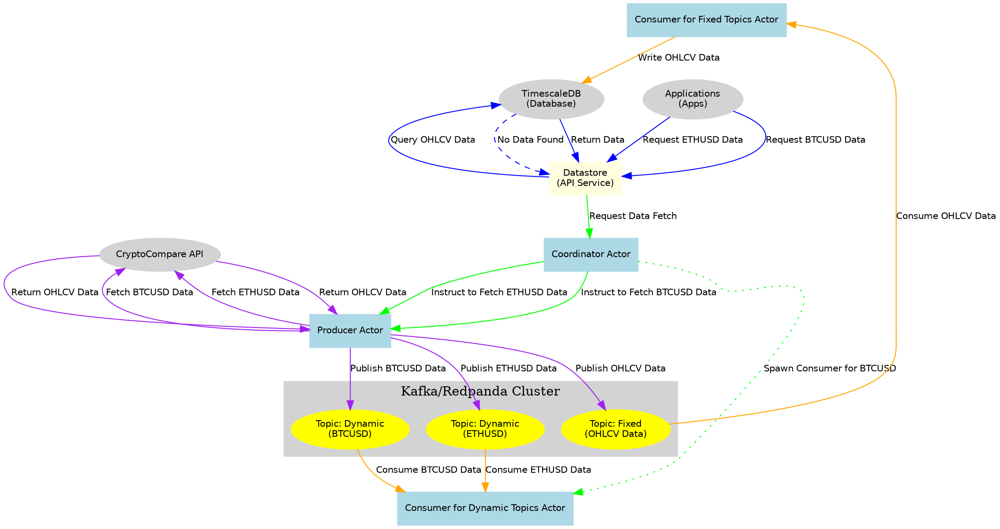
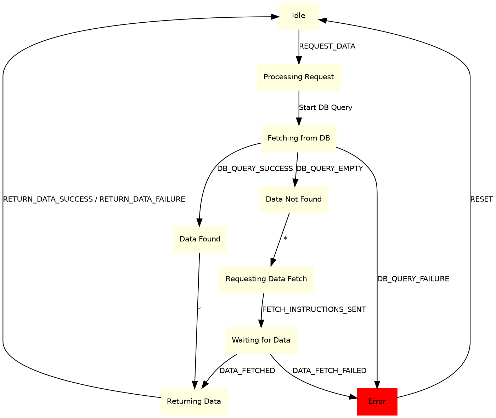
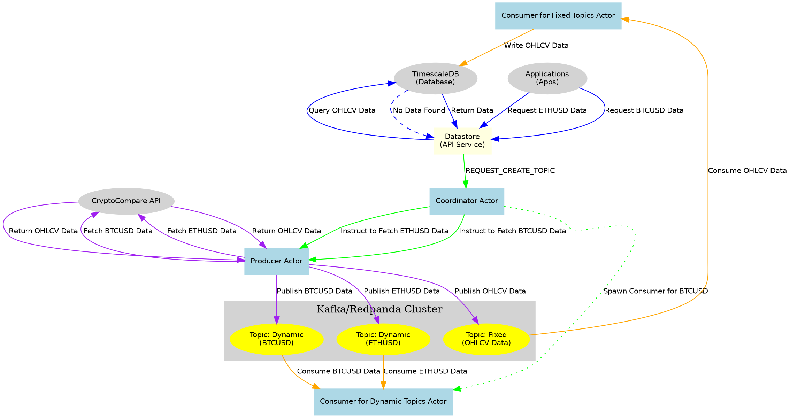
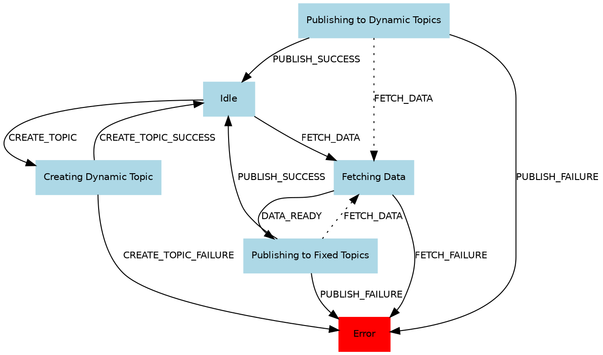
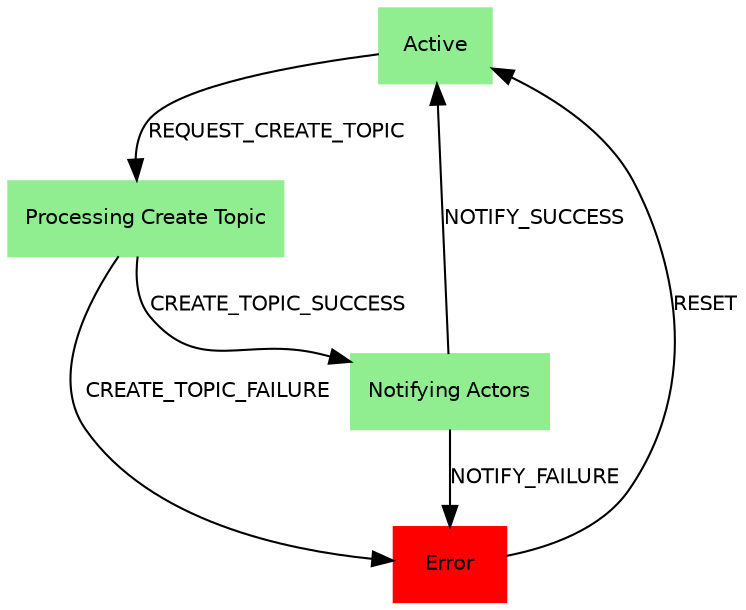
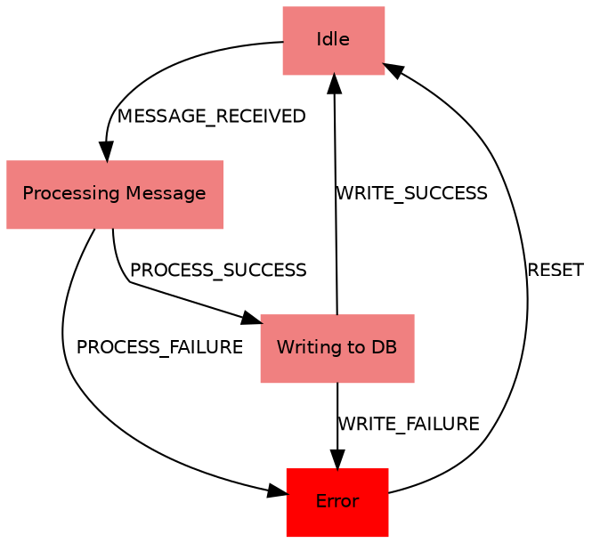
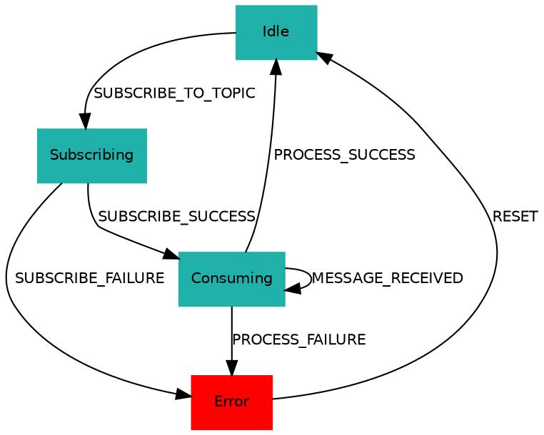
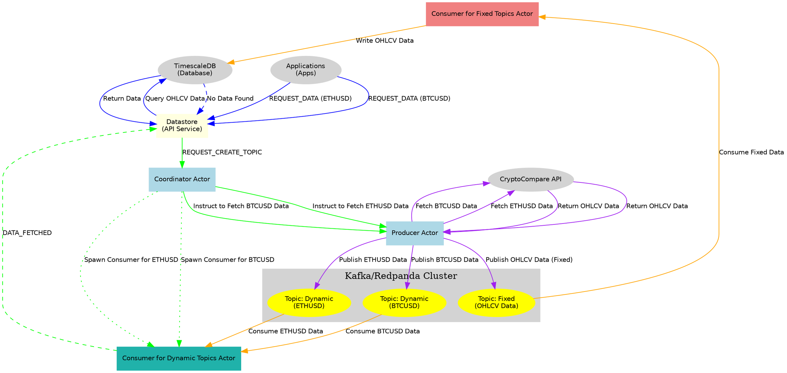

>Let's build a datastore, it provides the api for app to aquire data. Let's say an app ask for BTCUSD the entire history of 1m ohlcv data. DataStore look for the data in database, if the data is there, it feed back the data to app, if not, it ask producer to get the data and get the result from redpanda. In this way, app does not need to know the data platform, it communicate with datastore. Is this make sense? If it does, how to integrate this into the data platform?

10月13日 00:17 会话ID:(4649420)

Your proposed architecture makes perfect sense and aligns well with best practices for building scalable, decoupled, and maintainable data platforms. Integrating a **Datastore** as an intermediary between your **Applications** and the **Data Platform** ensures that your applications remain agnostic of the underlying data sources and processing mechanisms. This abstraction not only simplifies application development but also enhances the flexibility and scalability of your data infrastructure.

### **1. Architectural Overview**

**Current Components:**

- **Producer Actor:** Fetches data from external sources (e.g., CryptoCompare) and publishes it to Kafka/Redpanda topics.
- **Coordinator Actor:** Manages dynamic topic creation and orchestrates interactions between Producers and Consumers.
- **Consumer for Fixed Topics Actor:** Subscribes to fixed topics and pushes data to databases like TimescaleDB.
- **Consumer for Dynamic Topics Actor:** Subscribes to dynamically created topics for application-specific consumption.

**New Component:**

- **Datastore (API Service):** Acts as the interface for applications to request data. It abstracts the complexities of the data platform, handling data retrieval from the database or initiating data fetch via the Producer when necessary.

### **2. Data Flow Diagram**

To visualize the integration of the **Datastore** into your existing architecture, below is a **Graphviz** diagram depicting the interactions between all components, including the new Datastore.

#### **2.1. Conceptual Graphviz Diagram**



#### **2.2. Diagram Explanation**

1. **Applications Interaction:**
   - **Applications** send data requests to the **Datastore (API Service)**.
   - The **Datastore** queries the **TimescaleDB** to check if the requested OHLCV data exists.
   - If data is found, it's returned directly to the **Applications**.
   - If data is not found, the **Datastore** requests the **Coordinator Actor** to initiate a data fetch.

2. **Data Fetching Process:**
   - The **Coordinator** instructs the **Producer Actor** to fetch the required data (e.g., BTCUSD) from **CryptoCompare API**.
   - The **Producer** fetches data from **CryptoCompare** and publishes it to the **Fixed Topic** (`Topic: Fixed`).
   - The **Consumer for Fixed Topics Actor** consumes data from this fixed topic and writes it to **TimescaleDB**.
   - Simultaneously, the **Coordinator** spawns a **Consumer for Dynamic Topics Actor** for the newly created dynamic topic (e.g., `Topic: Dynamic BTCUSD`).

3. **Dynamic Consumption:**
   - The **Consumer for Dynamic Topics Actor** subscribes to the newly created dynamic topics (e.g., BTCUSD, ETHUSD).
   - **Applications** can now subscribe to these dynamic topics through the **Datastore**, which internally manages the data flow without exposing the Kafka/Redpanda cluster details.

4. **Error Handling:**
   - Each actor includes an **Error** state to handle failures gracefully, ensuring that one component's failure doesn't cascade throughout the system.

### **3. Integrating the Datastore into the Data Platform**

To achieve this integration effectively, we can model the **Datastore (API Service)** as an **actor** using **XState**. This actor will handle API requests from applications, interact with the database, and communicate with the existing Coordinator and Producer actors as needed.

#### **3.1. Defining the Datastore Actor State Machine**

**Purpose:** Manage API requests, interact with the database, and coordinate data fetching when necessary.

**States:**

1. **idle:** Awaiting API requests.
2. **processingRequest:** Handling an incoming API request.
3. **fetchingFromDB:** Querying the database for requested data.
4. **dataFound:** Data retrieved from the database.
5. **dataNotFound:** Data missing from the database; initiating fetch.
6. **waitingForData:** Waiting for the data to be fetched and published.
7. **returningData:** Sending the retrieved or freshly fetched data back to the application.
8. **error:** Handling any errors during the process.

**Events:**

- `REQUEST_DATA`: Triggered by an API call from an application.
- `DB_QUERY_SUCCESS`
- `DB_QUERY_FAILURE`
- `FETCH_INSTRUCTIONS_SENT`: Indicates that the Coordinator has been instructed to fetch data.
- `DATA_FETCHED`: Data has been fetched by the Producer and consumed by the Consumer.
- `RETURN_DATA_SUCCESS`
- `RETURN_DATA_FAILURE`
- `RESET`: Resetting the Datastore's state after an error or completion.

**Context:**

- `requestedTopic`: The data topic requested by the application (e.g., BTCUSD).
- `requestedTimeframe`: The data timeframe (e.g., 1m, 5m).
- `data`: The data retrieved from the DB or fetched.
- `errorInfo`: Details about any errors encountered.

#### **3.2. Graphviz Diagram for Datastore Actor**



#### **3.3. Diagram Explanation**

- **Idle State:**
  - Waits for `REQUEST_DATA` events from applications.
  
- **Processing Request State:**
  - Initiates a database query to fetch the requested data.
  
- **Fetching from DB State:**
  - Executes the database query.
  - Transitions to:
    - **Data Found:** If data exists.
    - **Data Not Found:** If data is missing.
    - **Error:** If the query fails.
  
- **Data Found State:**
  - Moves directly to `Returning Data` state to send data back to the application.
  
- **Data Not Found State:**
  - Moves to `Fetching Data` state to initiate a data fetch via the Coordinator.
  
- **Fetching Data State:**
  - Sends a `FETCH_INSTRUCTIONS_SENT` event to the Coordinator, instructing it to fetch the missing data.
  
- **Waiting for Data State:**
  - Awaits the `DATA_FETCHED` event after the Producer fetches and publishes data.
  
- **Returning Data State:**
  - Sends the retrieved data back to the application.
  - Transitions back to `Idle` on success or to `Error` on failure.
  
- **Error State:**
  - Handles any errors encountered during the process.
  - Can transition back to `Idle` to allow for retry mechanisms or further actions.

#### **3.4. Implementing the Datastore Actor with XState**

Here's how you can define the **Datastore Actor** using **XState**:

```typescript
// src/stateMachines/DatastoreActor.ts

import { createMachine, assign, sendParent } from "xstate";
import { WorkflowEvent, DatastoreEvent, DatastoreContext } from "../types";
import logger from "../utils/logger";

export const DatastoreActor = createMachine<DatastoreContext, DatastoreEvent>({
    id: "datastoreActor",
    initial: "idle",
    context: {
        requestedTopic: "",
        requestedTimeframe: "",
        data: null,
        errorInfo: "",
    },
    states: {
        idle: {
            on: {
                REQUEST_DATA: {
                    target: "processingRequest",
                    actions: assign({
                        requestedTopic: (context, event) => event.topic,
                        requestedTimeframe: (context, event) => event.timeframe,
                        data: (_) => null,
                        errorInfo: (_) => "",
                    }),
                },
            },
        },
        processingRequest: {
            invoke: {
                id: "queryDatabase",
                src: (context, event) => queryDatabaseService(context),
                onDone: [
                    {
                        target: "dataFound",
                        cond: (context, event) => event.data.found,
                        actions: assign({
                            data: (context, event) => event.data.data,
                        }),
                    },
                    {
                        target: "dataNotFound",
                        cond: (context, event) => !event.data.found,
                    },
                ],
                onError: {
                    target: "error",
                    actions: assign({
                        errorInfo: (context, event) => event.data.message,
                    }),
                },
            },
        },
        dataFound: {
            entry: "returnData",
            on: {
                RETURN_DATA_SUCCESS: "idle",
                RETURN_DATA_FAILURE: {
                    target: "error",
                    actions: assign({
                        errorInfo: (context, event) => event.data.message,
                    }),
                },
            },
        },
        dataNotFound: {
            invoke: {
                id: "requestDataFetch",
                src: (context, event) => requestDataFetchService(context),
                onDone: {
                    target: "waitingForData",
                },
                onError: {
                    target: "error",
                    actions: assign({
                        errorInfo: (context, event) => event.data.message,
                    }),
                },
            },
        },
        waitingForData: {
            on: {
                DATA_FETCHED: {
                    target: "returningData",
                    actions: assign({
                        data: (context, event) => event.data,
                    }),
                },
                DATA_FETCH_FAILED: {
                    target: "error",
                    actions: assign({
                        errorInfo: (context, event) => event.data.message,
                    }),
                },
            },
        },
        returningData: {
            invoke: {
                id: "returnDataToApp",
                src: (context, event) => returnDataToAppService(context),
                onDone: {
                    target: "idle",
                },
                onError: {
                    target: "error",
                    actions: assign({
                        errorInfo: (context, event) => event.data.message,
                    }),
                },
            },
        },
        error: {
            entry: "logError",
            on: {
                RESET: {
                    target: "idle",
                    actions: assign({
                        requestedTopic: (_) => "",
                        requestedTimeframe: (_) => "",
                        data: (_) => null,
                        errorInfo: (_) => "",
                    }),
                },
            },
        },
    },
},
{
    actions: {
        returnData: (context, event) => {
            logger.info(`Datastore: Returning data for ${context.requestedTopic} ${context.requestedTimeframe}`);
            // Implement the logic to return data to the application (e.g., via API response)
        },
        logError: (context, event) => {
            logger.error(`Datastore Error: ${context.errorInfo}`);
        },
    },
});

// Mock service to query the database
const queryDatabaseService = async (context) => {
    // Replace this with actual database query logic
    // Return { found: boolean, data: any }
    const { requestedTopic, requestedTimeframe } = context;
    logger.info(`Datastore: Querying DB for ${requestedTopic} ${requestedTimeframe}`);

    // Simulate DB check
    const dataExists = Math.random() > 0.5; // Randomly decide if data exists
    if (dataExists) {
        return { found: true, data: { ohlcv: "Sample Data" } };
    } else {
        return { found: false };
    }
};

// Mock service to request data fetch via Coordinator
const requestDataFetchService = async (context) => {
    const { requestedTopic, requestedTimeframe } = context;
    logger.info(`Datastore: Requesting data fetch for ${requestedTopic} ${requestedTimeframe}`);

    // Send an event to Coordinator to fetch data
    // In reality, this might be done via actor messaging or API calls
    // For demonstration, we'll simulate a delay and assume success
    await new Promise((resolve) => setTimeout(resolve, 2000));
    return;
};

// Mock service to return data to the application
const returnDataToAppService = async (context) => {
    const { data } = context;
    logger.info(`Datastore: Returning data to application`);
    // Implement the actual response mechanism here
    // For example, emit an event or call a callback
    return;
};
```

#### **3.4. Diagram for Datastore Actor**


### **4. Integrating the Datastore into the Existing Data Platform**

To seamlessly integrate the **Datastore (API Service)** into your data platform with the existing actors, you need to establish **communication channels** and **interaction patterns** between the **Datastore** and the **Coordinator**, as well as between the **Coordinator** and other actors like the **Producer** and **Consumer for Dynamic Topics**.

#### **4.1. Communication Flow**

1. **Data Request:**
   - **Application** sends a `REQUEST_DATA` event to the **Datastore** with parameters like `topicName` (e.g., BTCUSD) and `timeframe` (e.g., 1m).

2. **Datastore Processing:**
   - **Datastore** checks **TimescaleDB** for the requested data.
     - **If Data Exists:** Returns the data to the **Application**.
     - **If Data Missing:** Sends a `REQUEST_CREATE_TOPIC` event to the **Coordinator** to fetch the missing data.

3. **Coordinator Orchestration:**
   - **Coordinator** receives the `REQUEST_CREATE_TOPIC` event and instructs the **Producer** to fetch data from **CryptoCompare**.
   - **Producer** fetches data and publishes it to a **Fixed Topic** (e.g., `Topic: Fixed (OHLCV Data)`).

4. **Data Consumption and Storage:**
   - **Consumer for Fixed Topics Actor** consumes data from the fixed topic and writes it to **TimescaleDB**.
   - Upon successful data ingestion, the **Coordinator** may:
     - Notify the **Datastore** that the data is now available.
     - Instruct the **Coordinator** to spawn a **Consumer for Dynamic Topics Actor** for the new data, allowing **Applications** to consume it through **Dynamic Topics** if needed.

5. **Dynamic Consumption:**
   - **Consumer for Dynamic Topics Actor** subscribes to the newly created dynamic topic (e.g., `Topic: Dynamic BTCUSD`).
   - **Applications** can now consume data from these dynamic topics as needed without knowing the underlying data flow.

#### **4.2. Updated Data Flow Diagram**

Here’s an updated **Graphviz** diagram that includes the **Datastore** and illustrates the complete data flow:



#### **4.3. Diagram Explanation**

1. **Applications Interaction:**
   - **Applications** send `REQUEST_DATA` to the **Datastore** specifying the `topicName` (e.g., BTCUSD) and `timeframe` (e.g., 1m).
   
2. **Datastore Processing:**
   - **Datastore** queries **TimescaleDB**:
     - **If Data Exists:** Returns the data directly to the **Applications**.
     - **If Data is Missing:** Sends a `REQUEST_CREATE_TOPIC` event to the **Coordinator**.

3. **Coordinator Orchestration:**
   - **Coordinator** receives the `REQUEST_CREATE_TOPIC` and instructs the **Producer** to fetch BTCUSD data from **CryptoCompare API**.
   
4. **Data Acquisition and Publication:**
   - **Producer** fetches data from **CryptoCompare** and publishes it to both:
     - **Fixed Topic:** `Topic: Fixed (OHLCV Data)` consumed by **Consumer Fixed Actor**.
     - **Dynamic Topic:** `Topic: Dynamic BTCUSD` consumed by **Consumer Dynamic Actor**.
   
5. **Data Consumption and Storage:**
   - **Consumer for Fixed Topics Actor** consumes data from the fixed topic and writes it to **TimescaleDB**.
   - **Consumer for Dynamic Topics Actor** consumes data from the dynamic topic, making it available to **Applications** via the **Datastore**.

6. **Notification and Dynamic Topic Management:**
   - The **Coordinator** may spawn additional **Consumer Dynamic Actors** based on the type of dynamic topics created, allowing for scalable and flexible data consumption by various applications.

7. **Error Handling:**
   - Each actor has an **Error State** to handle any failures, ensuring robustness and resilience in the data flow.

### **5. Integrating with XState**

To effectively manage and coordinate these actors using **XState**, follow these steps:

#### **5.1. Define TypeScript Types**

Extend your `types.ts` to include events and contexts for the **Datastore Actor**.

```typescript
// src/types.ts

import { ActorRefFrom } from "xstate";
import { ProducerActor } from "./stateMachines/ProducerActor";
import { CoordinatorActor } from "./stateMachines/CoordinatorActor";
import { ConsumerFixedActor } from "./stateMachines/ConsumerFixedActor";
import { ConsumerDynamicActor } from "./stateMachines/ConsumerDynamicActor";

// Existing Types...

// Datastore Events
export type DatastoreEvent =
    | { type: "REQUEST_DATA"; topic: string; timeframe: string }
    | { type: "DB_QUERY_SUCCESS"; data: any }
    | { type: "DB_QUERY_EMPTY" }
    | { type: "DB_QUERY_FAILURE"; message: string }
    | { type: "FETCH_INSTRUCTIONS_SENT" }
    | { type: "DATA_FETCHED"; data: any }
    | { type: "DATA_FETCH_FAILED"; message: string }
    | { type: "RETURN_DATA_SUCCESS" }
    | { type: "RETURN_DATA_FAILURE"; message: string }
    | { type: "RESET" };

// Datastore Context
export interface DatastoreContext {
    requestedTopic: string;
    requestedTimeframe: string;
    data: any;
    errorInfo: string;
}

// Workflow Events now include DatastoreEvent or handled via separate machines
export type WorkflowEvent =
    | { type: "INIT_DB_PROVISION" }
    | { type: "DB_PROVISION_DONE"; data: { record: AppRecord } }
    | { type: "DB_PROVISION_FAILED"; error: string }
    | { type: "START_WORKFLOW" }
    | { type: "WORKFLOW_COMPLETED" }
    | { type: "ERROR"; message: string }
    | { type: "RETRY" }
    | CoordinatorEvent;

// Other existing events...
```

#### **5.2. Implement the Datastore Actor**

```typescript
// src/stateMachines/DatastoreActor.ts

import { createMachine, assign, sendParent } from "xstate";
import { DatastoreContext, DatastoreEvent, WorkflowEvent } from "../types";
import logger from "../utils/logger";

export const DatastoreActor = createMachine<DatastoreContext, DatastoreEvent>({
    id: "datastoreActor",
    initial: "idle",
    context: {
        requestedTopic: "",
        requestedTimeframe: "",
        data: null,
        errorInfo: "",
    },
    states: {
        idle: {
            on: {
                REQUEST_DATA: {
                    target: "processingRequest",
                    actions: assign({
                        requestedTopic: (context, event) => event.topic,
                        requestedTimeframe: (context, event) => event.timeframe,
                        data: (_) => null,
                        errorInfo: (_) => "",
                    }),
                },
            },
        },
        processingRequest: {
            invoke: {
                id: "queryDatabase",
                src: (context, event) => queryDatabaseService(context),
                onDone: [
                    {
                        target: "dataFound",
                        cond: (context, event) => event.data.found,
                        actions: assign({
                            data: (context, event) => event.data.data,
                        }),
                    },
                    {
                        target: "dataNotFound",
                        cond: (context, event) => !event.data.found,
                    },
                ],
                onError: {
                    target: "error",
                    actions: assign({
                        errorInfo: (context, event) => event.data.message,
                    }),
                },
            },
        },
        dataFound: {
            invoke: {
                id: "returnData",
                src: (context, event) => returnDataToAppService(context),
                onDone: {
                    target: "idle",
                },
                onError: {
                    target: "error",
                    actions: assign({
                        errorInfo: (context, event) => event.data.message,
                    }),
                },
            },
        },
        dataNotFound: {
            invoke: {
                id: "requestDataFetch",
                src: (context, event) => requestDataFetchService(context),
                onDone: {
                    target: "waitingForData",
                },
                onError: {
                    target: "error",
                    actions: assign({
                        errorInfo: (context, event) => event.data.message,
                    }),
                },
            },
        },
        waitingForData: {
            on: {
                DATA_FETCHED: {
                    target: "returningData",
                    actions: assign({
                        data: (context, event) => event.data,
                    }),
                },
                DATA_FETCH_FAILED: {
                    target: "error",
                    actions: assign({
                        errorInfo: (context, event) => event.data.message,
                    }),
                },
            },
        },
        returningData: {
            invoke: {
                id: "returnDataToApp",
                src: (context, event) => returnDataToAppService(context),
                onDone: {
                    target: "idle",
                },
                onError: {
                    target: "error",
                    actions: assign({
                        errorInfo: (context, event) => event.data.message,
                    }),
                },
            },
        },
        error: {
            entry: "logError",
            on: {
                RESET: {
                    target: "idle",
                    actions: assign({
                        requestedTopic: (_) => "",
                        requestedTimeframe: (_) => "",
                        data: (_) => null,
                        errorInfo: (_) => "",
                    }),
                },
            },
        },
    },
},
{
    actions: {
        logError: (context, event) => {
            logger.error(`Datastore Error: ${context.errorInfo}`);
        },
    },
});

// Mock service to query the database
const queryDatabaseService = async (context) => {
    // Replace this with actual database query logic
    // Return { found: boolean, data: any }
    const { requestedTopic, requestedTimeframe } = context;
    logger.info(`Datastore: Querying DB for ${requestedTopic} ${requestedTimeframe}`);

    // Simulate DB check
    const dataExists = Math.random() > 0.5; // Randomly decide if data exists
    if (dataExists) {
        // Simulate retrieved data
        return { found: true, data: { ohlcv: "Sample OHLCV Data" } };
    } else {
        return { found: false };
    }
};

// Mock service to request data fetch via Coordinator
const requestDataFetchService = async (context) => {
    const { requestedTopic, requestedTimeframe } = context;
    logger.info(`Datastore: Requesting data fetch for ${requestedTopic} ${requestedTimeframe}`);

    // In a real implementation, send an event to Coordinator Actor
    // Here, we'll simulate by sending a WorkflowEvent
    // Assuming you have access to the Coordinator actor's interpreter
    // Example: send(Coordinator, { type: 'REQUEST_CREATE_TOPIC', topicName: requestedTopic, partitions: 3 });

    // For demonstration, we'll simulate a delay and assume success
    await new Promise((resolve) => setTimeout(resolve, 2000));
    return;
};

// Mock service to return data to the application
const returnDataToAppService = async (context) => {
    const { data } = context;
    logger.info(`Datastore: Returning data to application`);
    // Implement the actual response mechanism here
    // For example, resolve a promise, emit an event, or call a callback
    return;
};
```

#### **5.3. Integration with Existing Actors**

To facilitate communication between the **Datastore Actor** and the existing **Coordinator Actor**, consider the following strategies:

1. **Actor Messaging:**
   - Utilize **XState's actor messaging** capabilities to send events between actors.
   - For example, when the **Datastore** needs to request data fetch, it sends a `REQUEST_CREATE_TOPIC` event to the **Coordinator Actor**.

2. **Shared Context or Services:**
   - Use shared services or context if multiple actors need access to common data or functionality.
   - For instance, the **Coordinator** might have access to the same database services used by the **Consumer for Fixed Topics Actor**.

3. **Event Bus or Pub/Sub Mechanism:**
   - Implement an **event bus** or **publish-subscribe** system to facilitate loosely coupled communication.
   - Actors can publish events to specific topics, and interested actors can subscribe to those topics.

#### **5.4. Example Interaction via Actor Messaging**

```typescript
// src/stateMachines/DatastoreActor.ts

// ... (previous code)

const requestDataFetchService = async (context, event, { send }) => {
    const { requestedTopic, requestedTimeframe } = context;
    logger.info(`Datastore: Requesting data fetch for ${requestedTopic} ${requestedTimeframe}`);

    // Send a REQUEST_CREATE_TOPIC event to Coordinator Actor
    sendParent({
        type: "REQUEST_CREATE_TOPIC",
        topicName: requestedTopic,
        partitions: 3, // Example partition count
    });

    // Wait for Coordinator to process and fetch data
    // This might involve setting up a listener or another event to handle DATA_FETCHED
    // For demonstration, we'll simulate it with a timeout
    await new Promise((resolve) => setTimeout(resolve, 2000));
    return;
};
```

This function sends a `REQUEST_CREATE_TOPIC` event to the **Coordinator Actor**, which then coordinates with the **Producer Actor** to fetch and publish the data.

### **6. Recommendations for Implementation**

1. **Modularize Actors:**
   - Keep each actor's state machine in separate files for better maintainability.
  
2. **Use Actor References:**
   - When defining the main workflow or higher-level actors, use references to these actors to facilitate communication.

3. **Leverage XState Features:**
   - Utilize **guards**, **actions**, and **services** to manage complex logic and side-effects within your state machines.
   - Use **XState’s parallel states** if some processes need to run concurrently.

4. **Error Handling:**
   - Ensure that each actor gracefully handles errors without affecting other components.
   - Implement retry mechanisms where appropriate.

5. **Logging and Monitoring:**
   - Integrate comprehensive logging within each actor to monitor the state transitions and data flow.
   - Consider using **XState Inspector** for real-time visualization and debugging.

6. **Testing:**
   - Write unit and integration tests for each state machine to ensure they behave as expected.
  
7. **Scalability:**
   - Design actors to be stateless where possible, allowing multiple instances to run concurrently for load balancing.

8. **Documentation:**
   - Maintain clear documentation for each actor, detailing their states, transitions, events, and interactions with other actors.

### **7. Extended Graphviz Diagrams for Each Actor**

To provide clarity, below are individual **Graphviz DOT** diagrams for each actor, including the newly integrated **Datastore Actor**.

#### **7.1. Producer Actor**



#### **7.2. Coordinator Actor**



#### **7.3. Consumer for Fixed Topics Actor**



#### **7.4. Consumer for Dynamic Topics Actor**



#### **7.5. Datastore Actor**


### **8. Putting It All Together: Overall System Interaction Diagram**

For a holistic view, combining all actors, the Datastore, external systems, and their interactions is crucial. Here's an extended **Graphviz** diagram that encapsulates the entire data flow:



#### **8.1. Diagram Interpretation**

1. **Applications Interaction:**
   - **Applications** initiate data requests by sending `REQUEST_DATA` events to the **Datastore** for specific topics like BTCUSD or ETHUSD.
   
2. **Datastore Processing:**
   - The **Datastore** queries **TimescaleDB** to check for existing data.
   - If data exists, it's sent back to the **Applications**.
   - If data is missing, the **Datastore** sends a `REQUEST_CREATE_TOPIC` event to the **Coordinator Actor** to fetch the required data.

3. **Coordinator Orchestration:**
   - The **Coordinator Actor** receives the request and instructs the **Producer Actor** to fetch data for the specified topics (e.g., BTCUSD, ETHUSD) from **CryptoCompare**.

4. **Data Fetching and Publication:**
   - The **Producer Actor** fetches data from **CryptoCompare** and publishes it to both **Fixed Topics** and **Dynamic Topics** (`Topic: Dynamic BTCUSD`, `Topic: Dynamic ETHUSD`).

5. **Data Consumption and Persistence:**
   - **Consumer for Fixed Topics Actor** consumes data from the **Fixed Topic** and writes it to **TimescaleDB**.
   
6. **Dynamic Topic Consumption:**
   - The **Coordinator Actor** spawns a **Consumer Dynamic Actor** for each new dynamic topic (`BTCUSD`, `ETHUSD`).
   - **Consumer for Dynamic Topics Actor** subscribes to these dynamic topics and consumes the data.
   - Consumed data can be further processed or sent back to the **Datastore** if necessary.

7. **Data Retrieval Flow:**
   - Once data is published to both fixed and dynamic topics, the **Datastore** can now retrieve the data from **TimescaleDB** and serve it to the **Applications**.
   
8. **Error Handling:**
   - Each actor is equipped with an **Error State** to handle and recover from failures without affecting the entire system.

### **9. Implementing the Datastore Actor with XState**

To integrate the **Datastore (API Service)** with your existing data platform, you can define it as an **XState Actor** that interacts with other actors via events. Below is a simplified implementation:

```typescript
// src/stateMachines/DatastoreActor.ts

import { createMachine, assign } from "xstate";
import { DatastoreContext, DatastoreEvent } from "../types";
import logger from "../utils/logger";

export const DatastoreActor = createMachine<DatastoreContext, DatastoreEvent>({
    id: "datastoreActor",
    initial: "idle",
    context: {
        requestedTopic: "",
        requestedTimeframe: "",
        data: null,
        errorInfo: "",
    },
    states: {
        idle: {
            on: {
                REQUEST_DATA: {
                    target: "processingRequest",
                    actions: assign({
                        requestedTopic: (context, event) => event.topic,
                        requestedTimeframe: (context, event) => event.timeframe,
                        data: (_) => null,
                        errorInfo: (_) => "",
                    }),
                },
            },
        },
        processingRequest: {
            invoke: {
                id: "queryDatabase",
                src: (context, event) => queryDatabaseService(context),
                onDone: [
                    {
                        target: "dataFound",
                        cond: (context, event) => event.data.found,
                        actions: assign({
                            data: (context, event) => event.data.data,
                        }),
                    },
                    {
                        target: "dataNotFound",
                        cond: (context, event) => !event.data.found,
                    },
                ],
                onError: {
                    target: "error",
                    actions: assign({
                        errorInfo: (context, event) => event.data.message,
                    }),
                },
            },
        },
        dataFound: {
            invoke: {
                id: "returnData",
                src: (context, event) => returnDataToAppService(context),
                onDone: {
                    target: "idle",
                },
                onError: {
                    target: "error",
                    actions: assign({
                        errorInfo: (context, event) => event.data.message,
                    }),
                },
            },
        },
        dataNotFound: {
            invoke: {
                id: "requestDataFetch",
                src: (context, event) => requestDataFetchService(context),
                onDone: {
                    target: "waitingForData",
                },
                onError: {
                    target: "error",
                    actions: assign({
                        errorInfo: (context, event) => event.data.message,
                    }),
                },
            },
        },
        waitingForData: {
            on: {
                DATA_FETCHED: {
                    target: "returningData",
                    actions: assign({
                        data: (context, event) => event.data,
                    }),
                },
                DATA_FETCH_FAILED: {
                    target: "error",
                    actions: assign({
                        errorInfo: (context, event) => event.data.message,
                    }),
                },
            },
        },
        returningData: {
            invoke: {
                id: "returnDataToApp",
                src: (context, event) => returnDataToAppService(context),
                onDone: {
                    target: "idle",
                },
                onError: {
                    target: "error",
                    actions: assign({
                        errorInfo: (context, event) => event.data.message,
                    }),
                },
            },
        },
        error: {
            entry: "logError",
            on: {
                RESET: {
                    target: "idle",
                    actions: assign({
                        requestedTopic: (_) => "",
                        requestedTimeframe: (_) => "",
                        data: (_) => null,
                        errorInfo: (_) => "",
                    }),
                },
            },
        },
    },
},
{
    actions: {
        logError: (context, event) => {
            logger.error(`Datastore Error: ${context.errorInfo}`);
        },
    },
});

// Mock service to query the database
const queryDatabaseService = async (context) => {
    // Replace this with actual database query logic
    // Return { found: boolean, data: any }
    const { requestedTopic, requestedTimeframe } = context;
    logger.info(`Datastore: Querying DB for ${requestedTopic} ${requestedTimeframe}`);

    // Simulate DB check
    const dataExists = Math.random() > 0.5; // Randomly decide if data exists
    if (dataExists) {
        // Simulate retrieved data
        return { found: true, data: { ohlcv: "Sample OHLCV Data" } };
    } else {
        return { found: false };
    }
};

// Mock service to request data fetch via Coordinator
const requestDataFetchService = async (context, event, { sendParent }) => {
    const { requestedTopic, requestedTimeframe } = context;
    logger.info(`Datastore: Requesting data fetch for ${requestedTopic} ${requestedTimeframe}`);

    // Send a REQUEST_CREATE_TOPIC event to Coordinator Actor
    sendParent({
        type: "REQUEST_CREATE_TOPIC",
        topicName: requestedTopic,
        partitions: 3, // Example partition count
    });

    // Wait for Coordinator to process and fetch data
    // This might involve setting up a listener or another event to handle DATA_FETCHED
    // For demonstration, we'll simulate it with a timeout
    await new Promise((resolve) => setTimeout(resolve, 2000));
    return;
};

// Mock service to return data to the application
const returnDataToAppService = async (context, event) => {
    const { data } = context;
    logger.info(`Datastore: Returning data to application`);
    // Implement the actual response mechanism here, such as emitting an event or invoking a callback
    return;
};
```

#### **5.5. Integrating the Datastore Actor into the Main Workflow**

To integrate all actors, you can define a **Main Workflow Machine** that coordinates these actors. Here's how you might set it up:

```typescript
// src/stateMachines/MainWorkflow.ts

import { createMachine, assign, spawn } from "xstate";
import { WorkflowContext, WorkflowEvent, ProducerEvent, CoordinatorEvent } from "../types";
import { ProducerActor } from "./ProducerActor";
import { CoordinatorActor } from "./CoordinatorActor";
import { ConsumerFixedActor } from "./ConsumerFixedActor";
import { ConsumerDynamicActor } from "./ConsumerDynamicActor";
import { DatastoreActor } from "./DatastoreActor";
import logger from "../utils/logger";

export const MainWorkflow = createMachine<WorkflowContext, WorkflowEvent>({
    id: "mainWorkflow",
    initial: "initializing",
    context: {
        index: 0,
        mode: "Live",
        user: { id: "admin" },
        input: { email: "admin@example.com", active: true },
        dataLoaders: loaders,
        record: undefined,
        error: undefined,
        producerRef: undefined,
        coordinatorRef: undefined,
        consumerFixedRef: undefined,
        consumerDynamicRefs: [],
    },
    states: {
        initializing: {
            entry: "spawnActors",
            always: "ready",
        },
        ready: {
            on: {
                REQUEST_DATA: {
                    actions: "forwardToDatastore",
                },
                // Other global events
            },
        },
        // Additional states as needed
    },
},
{
    actions: {
        spawnActors: assign({
            producerRef: (context, event) => spawn(ProducerActor),
            coordinatorRef: (context, event) => spawn(CoordinatorActor),
            consumerFixedRef: (context, event) => spawn(ConsumerFixedActor),
            consumerDynamicRefs: (context, event) => [],
        }),
        forwardToDatastore: (context, event) => {
            // Forward the REQUEST_DATA event to the Datastore Actor
            context.datastoreRef.send(event);
        },
        // Additional actions as needed
    },
});
```

**Note:** Ensure that the **Datastore Actor** is also spawned during the initialization phase.

```typescript
// src/stateMachines/MainWorkflow.ts

import { DatastoreActor } from "./DatastoreActor";
// ... other imports

export const MainWorkflow = createMachine<WorkflowContext, WorkflowEvent>({
    // ... previous code
    states: {
        initializing: {
            entry: "spawnActors",
            always: "ready",
        },
        ready: {
            on: {
                REQUEST_DATA: {
                    actions: "forwardToDatastore",
                },
                // Other global events
            },
        },
        // Additional states as needed
    },
},
{
    actions: {
        spawnActors: assign({
            producerRef: (context, event) => spawn(ProducerActor),
            coordinatorRef: (context, event) => spawn(CoordinatorActor),
            consumerFixedRef: (context, event) => spawn(ConsumerFixedActor),
            consumerDynamicRefs: (context, event) => [],
        }),
        forwardToDatastore: (context, event) => {
            // Assuming datastoreRef is part of the context
            context.datastoreRef.send(event);
        },
        // Additional actions as needed
    },
});
```

### **10. Final Touches and Best Practices**

1. **Centralized Logging:**
   - Integrate a logging service to capture logs from all actors, facilitating easier debugging and monitoring.

2. **Error Management:**
   - Ensure each actor's **Error State** has clear recovery paths or notification mechanisms to alert administrators.

3. **Scalability:**
   - Design **Consumer Dynamic Actors** to handle multiple dynamic topics, potentially spawning new actors as new topics are created.

4. **Security:**
   - Implement authentication and authorization for API requests to the **Datastore**.
   - Secure communication channels between actors and external systems.

5. **Testing:**
   - Write comprehensive tests for each state machine to validate all possible transitions and edge cases.

6. **Documentation:**
   - Maintain clear and up-to-date documentation for each actor, including their state machines, events, and interactions.

7. **Monitoring and Alerting:**
   - Implement monitoring tools to track the health and performance of each actor and the overall data flow.
   - Set up alerting mechanisms for critical failures or performance bottlenecks.

### **11. Additional Resources**

- **[XState Documentation](https://xstate.js.org/docs/):** Comprehensive guides and API references.
- **[XState Visualizer](https://xstate.js.org/viz/):** Interactive tool to visualize and debug state machines.
- **[Kafka Documentation](https://kafka.apache.org/documentation/):** Detailed information on Kafka topics, consumers, and producers.
- **[Redpanda Documentation](https://docs.redpanda.com/):** Guides and references for Redpanda setup and usage.

---

By integrating the **Datastore** as an **XState Actor**, you've effectively abstracted the data retrieval logic from your applications, enabling a more modular and maintainable architecture. This setup not only simplifies application development but also allows your data platform to scale and adapt to varying data demands seamlessly.

If you need further assistance with specific implementation details, code examples, or additional architectural considerations, feel free to ask!