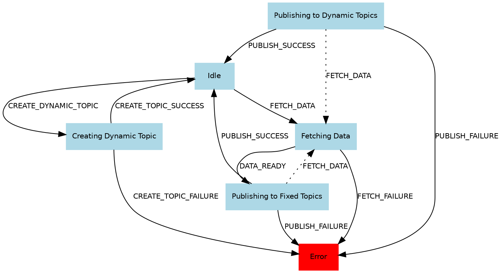
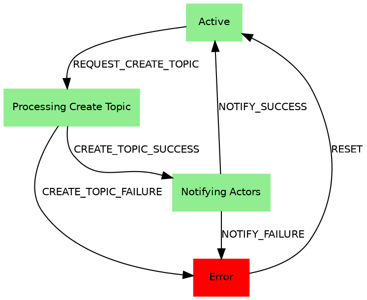
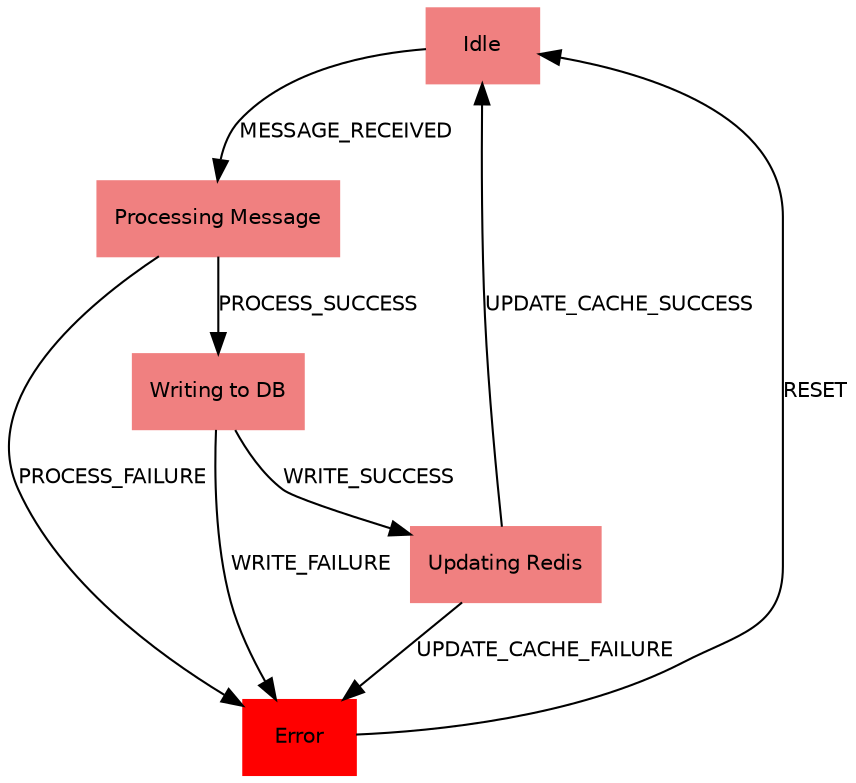
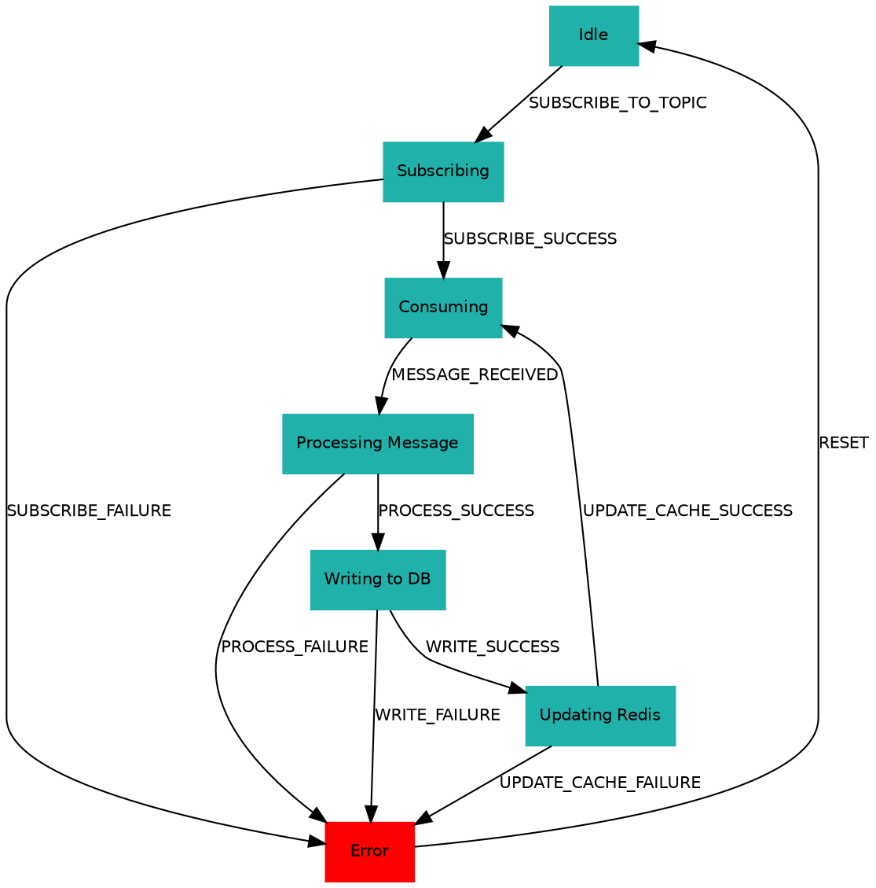
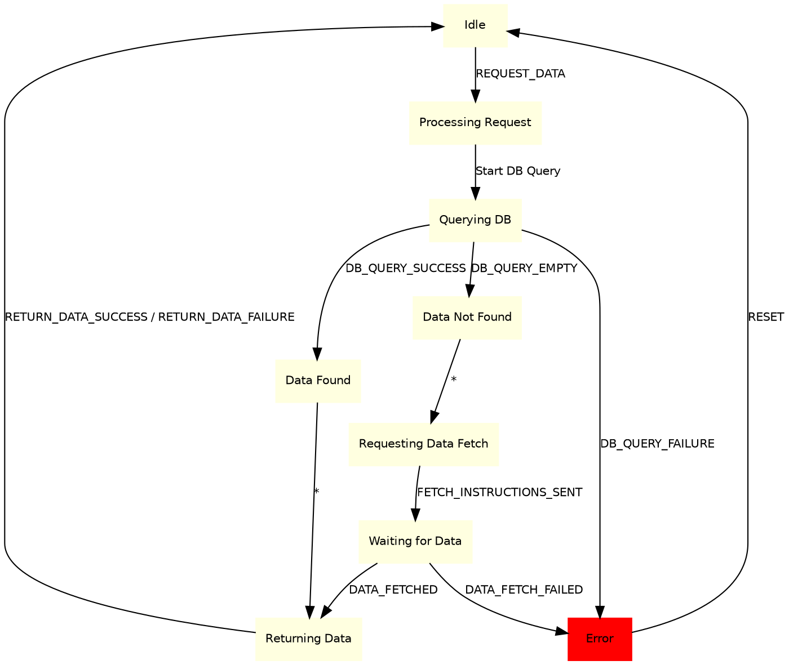
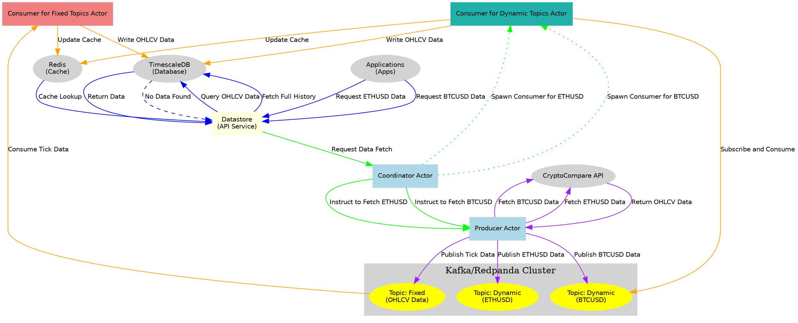

>you think we can make it work? We also need to add the realtime feed and be able to aggregate tick data into ohlcv. We should also utilize redis for caching. One more technical problem: we usually need to get the complete historical data, the start date of the data is specified by user, but we need to hook the historical data with realtime data feed, the last time stamped of the data from database often is not the current time stamped (for 1m ohlcv, the current time stamped is current minute), How to handle this in our platform?

10月13日 00:37 会话ID:(4649420)

Absolutely, your envisioned architecture is not only feasible but also robust and scalable for handling complex data workflows involving real-time feeds, historical data integration, data aggregation, and caching mechanisms. Below, I'll outline a comprehensive approach to integrating these components effectively into your data platform using **XState**, **Kafka/Redpanda**, **Redis**, and **TimescaleDB**.

## **1. Architectural Overview**

### **1.1. Core Components**

1. **Producer Actor:**
   - **Data Source:** Fetches real-time tick data from external APIs (e.g., CryptoCompare).
   - **Responsibilities:**
     - Ingest real-time data streams.
     - Publish tick data to fixed topics for aggregation.
     - Handle dynamic topic creation requests from the Coordinator.

2. **Coordinator Actor:**
   - **Responsibilities:**
     - Manages dynamic topic creation based on application needs.
     - Orchestrates interactions between Producers and Consumers.
     - Ensures synchronization between historical and real-time data.

3. **Consumer Fixed Topics Actor:**
   - **Responsibilities:**
     - Subscribes to fixed topics containing tick data.
     - Aggregates tick data into OHLCV (Open, High, Low, Close, Volume) formats.
     - Writes aggregated OHLCV data to **TimescaleDB**.
     - Caches recent OHLCV data in **Redis** for quick access.

4. **Consumer Dynamic Topics Actor:**
   - **Responsibilities:**
     - Subscribes to dynamically created topics tailored to specific application queries.
     - Serves aggregated OHLCV data to applications in real-time.
     - Utilizes **Redis** for caching to enhance response times.

5. **Datastore (API Service):**
   - **Responsibilities:**
     - Acts as an intermediary API layer for applications to request OHLCV data.
     - Interfaces with **TimescaleDB** and **Redis** to fetch and serve data.
     - Handles integration between historical data requests and real-time data feeds.

### **1.2. External Systems**

- **TimescaleDB:** Stores aggregated OHLCV data with time-series optimizations.
- **Redis:** Provides in-memory caching for recent OHLCV data to expedite data retrieval.
- **Kafka/Redpanda:** Serves as the data streaming platform facilitating message passing between Producers and Consumers.
- **CryptoCompare API:** External data source providing real-time tick data.

## **2. Handling Real-Time Feeds and Data Aggregation**

### **2.1. Real-Time Data Ingestion and Aggregation**

1. **Producer Actor:**
   - Continuously fetches tick data from CryptoCompare.
   - Publishes tick data to a fixed Kafka/Redpanda topic, e.g., `tick-data`.
   
2. **Consumer Fixed Topics Actor:**
   - Subscribes to the `tick-data` topic.
   - Aggregates incoming tick data into OHLCV format on 1-minute intervals using an in-memory aggregator or leveraging **TimescaleDB**'s capabilities.
   - Writes aggregated OHLCV data to **TimescaleDB**.
   - Updates **Redis** cache with the latest OHLCV data for quick access by applications.

### **2.2. Implementing Aggregation Logic**

To aggregate tick data into OHLCV, you can utilize either:

- **In-Memory Processing:**
  - Implement an in-memory aggregator within the Consumer Fixed Topics Actor.
  - Use JavaScript/TypeScript to compute OHLCV based on incoming ticks.

- **Database-Level Aggregation:**
  - Utilize TimescaleDB's continuous aggregates feature to automatically compute OHLCV from stored tick data.
  - This approach offloads aggregation logic to the database, enhancing scalability.

**Recommendation:** Leveraging **TimescaleDB's continuous aggregates** is preferable for scalability, reliability, and maintainability.

#### **TimescaleDB Continuous Aggregates Setup**

```sql
-- Create a hypertable for tick data
CREATE TABLE tick_data (
    timestamp TIMESTAMPTZ NOT NULL,
    symbol TEXT NOT NULL,
    price DOUBLE PRECISION NOT NULL,
    volume DOUBLE PRECISION NOT NULL
);

SELECT create_hypertable('tick_data', 'timestamp');

-- Create a continuous aggregate for 1-minute OHLCV
CREATE MATERIALIZED VIEW ohlcv_1m
WITH (timescaledb.continuous) AS
SELECT
    time_bucket('1 minute', timestamp) AS bucket,
    symbol,
    first(price, timestamp) AS open,
    max(price) AS high,
    min(price) AS low,
    last(price, timestamp) AS close,
    sum(volume) AS volume
FROM
    tick_data
GROUP BY
    bucket,
    symbol;

-- Refresh policy (optional)
SELECT add_continuous_aggregate_policy('ohlcv_1m',
    start_offset => INTERVAL '2 minutes',
    end_offset => INTERVAL '0 minutes',
    schedule_interval => INTERVAL '1 minute');
```

This setup ensures that OHLCV data is automatically aggregated every minute, simplifying your **Consumer Fixed Topics Actor** implementation.

## **3. Utilizing Redis for Caching**

### **3.1. Caching Strategy**

1. **Recent OHLCV Data:**
   - **Consumer Fixed Topics Actor** updates Redis with the latest OHLCV data every minute after aggregation.
   - **Key Structure:** Use a consistent key pattern, e.g., `ohlcv:{symbol}:{interval}:{timestamp}`. Example: `ohlcv:BTCUSD:1m:2023-08-01T12:00:00Z`.
   
2. **Access by Datastore:**
   - When an application requests OHLCV data, the **Datastore** first checks Redis for the required data.
   - If data exists in Redis and is within the requested timeframe, it is returned immediately.
   - If data is not found or incomplete, the **Datastore** queries **TimescaleDB**.

### **3.2. Redis Integration Steps**

1. **Setup Redis:**
   - Deploy a Redis instance (managed service or self-hosted).
   - Ensure it is accessible to both the **Consumer Fixed Topics Actor** and the **Datastore**.
   
2. **Implement Caching Logic in Consumer Fixed Topics Actor:**

```typescript
// Example in TypeScript using ioredis
import Redis from 'ioredis';

const redis = new Redis({
  host: 'localhost',
  port: 6379,
});

async function updateRedisCache(symbol: string, ohlcv: OhlcvData) {
  const key = `ohlcv:${symbol}:1m:${ohlcv.bucket.toISOString()}`;
  await redis.set(key, JSON.stringify(ohlcv), 'EX', 3600); // TTL 1 hour
}
```

3. **Implement Caching Retrieval in Datastore:**

```typescript
// Example in TypeScript using ioredis
import Redis from 'ioredis';

const redis = new Redis({
  host: 'localhost',
  port: 6379,
});

async function getOhlcvFromCache(symbol: string, interval: string, bucket: Date) {
  const key = `ohlcv:${symbol}:${interval}:${bucket.toISOString()}`;
  const data = await redis.get(key);
  return data ? JSON.parse(data) : null;
}
```

## **4. Integrating Historical Data with Real-Time Feeds**

### **4.1. The Challenge**

When a user requests historical data starting from a specific date:

- **Historical Data:** Retrieved from **TimescaleDB** based on the provided start date.
- **Real-Time Data:** Begins from the current time onwards.
- **Gap Issue:** The last timestamp in the historical data might not align precisely with the start of the real-time data, leading to potential overlaps or gaps.

### **4.2. Solution Strategy**

To seamlessly integrate historical data with real-time feeds, follow these steps:

1. **Determine the Last Timestamp in TimeScaleDB:**
   - Query the database to find the latest timestamp available for the requested symbol and timeframe.
   
```sql
SELECT max(bucket) FROM ohlcv_1m WHERE symbol = 'BTCUSD';
```

2. **Align Historical and Real-Time Data:**
   - **Fetch Historical Data:** Retrieve all OHLCV data from the start date up to the last available timestamp.
   - **Determine Real-Time Data Starting Point:** Start fetching real-time data from the next timestamp after the last one available in TimeScaleDB.
   - **Merge Data Streams:** Ensure that the real-time stream begins exactly where the historical data ends, preventing overlaps or gaps.

3. **Implement in Datastore:**

   - **Fetch Last Timestamp:**
     ```typescript
     async function getLastTimestamp(symbol: string): Promise<Date | null> {
       const result = await timescaleDB.query(
         'SELECT max(bucket) as last_bucket FROM ohlcv_1m WHERE symbol = $1',
         [symbol]
       );
       return result.rows[0].last_bucket ? new Date(result.rows[0].last_bucket) : null;
     }
     ```

   - **Handle API Request:**
     ```typescript
     async function handleOhlcvRequest(symbol: string, startDate: Date): Promise<OhlcvData[]> {
       // Step 1: Fetch from Redis (optional)
       // Step 2: Fetch historical data from TimescaleDB
       const lastTimestamp = await getLastTimestamp(symbol);
       let historicalData: OhlcvData[] = [];
       
       if (lastTimestamp) {
         historicalData = await timescaleDB.query(
           'SELECT * FROM ohlcv_1m WHERE symbol = $1 AND bucket >= $2',
           [symbol, startDate]
         );
       } else {
         historicalData = await timescaleDB.query(
           'SELECT * FROM ohlcv_1m WHERE symbol = $1 AND bucket >= $2',
           [symbol, startDate]
         );
       }
       
       // Step 3: Determine starting point for real-time data
       const realTimeStart = lastTimestamp ? new Date(lastTimestamp.getTime() + 60000) : startDate;
       
       // Step 4: Subscribe to real-time topic starting from realTimeStart
       // This would involve setting up a Kafka consumer with a specific offset or timestamp
       const realTimeData = await subscribeToRealTimeOhlcv(symbol, realTimeStart);
       
       // Step 5: Merge and return data
       return [...historicalData, ...realTimeData];
     }
     ```

4. **Handling Real-Time Subscription Based on Timestamp:**

   - **Kafka Offset Management:**
     - **Timestamp-based Offsets:** Kafka supports fetching messages based on a timestamp. Use this to align real-time data fetching.
   
   ```typescript
   async function subscribeToRealTimeOhlcv(symbol: string, startTime: Date): Promise<OhlcvData[]> {
     // Configure Kafka consumer to start from the specified timestamp
     const consumer = kafka.consumer({ groupId: `dynamic-consumer-${symbol}` });
     await consumer.connect();
     
     // Assign the consumer to the dynamic topic
     await consumer.subscribe({ topic: `dynamic-${symbol}`, fromBeginning: false });
     
     // Seek to the desired timestamp
     const timestamp = startTime.getTime();
     const partitions = await kafka.admin().fetchTopicPartitions(`dynamic-${symbol}`);
     
     for (const partition of partitions) {
       const offset = await kafka.admin().fetchOffsets({
         topic: `dynamic-${symbol}`,
         partitions: [partition],
       });
       const offsetForTime = await consumer.fetchOffsets({ topic: `dynamic-${symbol}`, partitions: [partition] });
       // Use Kafka's API to find the offset for the timestamp
       // This may require using kafkajs's 'fetchOneOffset' or similar methods
     }
     
     // Consume messages from the specified timestamp
     const realTimeData: OhlcvData[] = [];
     
     await consumer.run({
       eachMessage: async ({ message }) => {
         const data = JSON.parse(message.value.toString());
         realTimeData.push(data);
       }
     });
     
     return realTimeData;
   }
   ```

   **Note:** Implement appropriate logic to determine the exact offset corresponding to the `realTimeStart` timestamp. Libraries like [kafkajs](https://kafkajs.com/) facilitate this through their APIs.

### **4.3. Seamless Integration Steps**

1. **Application Sends API Request:**
   - Requests OHLCV data for `BTCUSD` starting from a specific date.
   
2. **Datastore Handles Request:**
   - **Step 1:** Checks **Redis** cache for the requested OHLCV data ranges.
   - **Step 2:** Queries **TimescaleDB** for historical data up to the latest available timestamp.
   - **Step 3:** Determines if additional real-time data needs to be fetched based on the requested start date and the last timestamp in the database.
   - **Step 4:** If needed, instructs the **Coordinator Actor** to initiate data fetching via the **Producer Actor**.

3. **Coordinator and Producer Workflow:**
   - **Coordinator Actor** receives a command to create a dynamic topic for the requested data range.
   - Instructs the **Producer Actor** to fetch the required data from **CryptoCompare API**.
   - **Producer Actor** fetches the data and publishes it to the newly created dynamic topic.
   
4. **Consumers Handle Data Flow:**
   - **Consumer Fixed Topics Actor** continues to aggregate real-time tick data into OHLCV and updates **TimescaleDB** and **Redis** accordingly.
   - **Consumer Dynamic Topics Actor** subscribes to the new dynamic topic, processes incoming data, and writes it to **TimescaleDB** and updates **Redis**.

5. **Datastore Completes Data Merging:**
   - Once real-time data starts flowing into **TimescaleDB**, **Datastore** merges historical and real-time data seamlessly and serves the complete dataset to the application.

## **5. Enhanced Graphviz Diagrams for Each Actor**

To visualize the integration of external data sources, databases, caching, and the interaction between actors and the datastore, let's create detailed **Graphviz** diagrams for each actor and an overall system interaction diagram.

### **5.1. Producer Actor Diagram**



### **5.2. Coordinator Actor Diagram**



### **5.3. Consumer Fixed Topics Actor Diagram**



### **5.4. Consumer Dynamic Topics Actor Diagram**



### **5.5. Datastore (API Service) Actor Diagram**



## **6. Overall System Interaction Diagram**

To encapsulate how all actors interact within the system, here's an **Overall System Interaction Diagram** combining all components, including **Datastore**, **Producers**, **Coordinator**, **Consumers**, **TimescaleDB**, **Redis**, and external applications/data sources.



### **6.1. Diagram Explanation**

- **Applications Interaction:**
  - Applications send requests to the **Datastore** for specific OHLCV data (e.g., BTCUSD).
  
- **Datastore Processing:**
  - The **Datastore** first queries **Redis** for cached OHLCV data.
  - If data is found in **Redis**, it is returned directly to the **Applications**.
  - If not, the **Datastore** queries **TimescaleDB** for historical data.
  - If historical data is found up to a certain timestamp, the **Datastore** merges this with real-time data.
  - If data is missing, the **Datastore** requests the **Coordinator** to fetch the required data.
  
- **Coordinator and Producer Workflow:**
  - The **Coordinator** instructs the **Producer** to fetch data for the requested symbol (e.g., BTCUSD) from **CryptoCompare**.
  - The **Producer** fetches the data and publishes it to both fixed and dynamic topics within the **Kafka/Redpanda Cluster**.
  
- **Consumers Handling Data:**
  - **Consumer Fixed Topics Actor**:
    - Subscribes to the fixed topic (`Topic: Fixed (OHLCV Data)`).
    - Aggregates incoming tick data into OHLCV and writes it to **TimescaleDB**.
    - Updates **Redis** cache with the latest OHLCV data.
  
  - **Consumer Dynamic Topics Actor**:
    - Subscribes to dynamically created topics (e.g., `Topic: Dynamic BTCUSD`).
    - Processes incoming data and writes it to **TimescaleDB**.
    - Updates **Redis** cache accordingly.
  
- **Data Flow:**
  - **Real-Time Data:** Continuously flows from **Producer** to **Fixed Topics**, gets aggregated, stored in **TimescaleDB**, and cached in **Redis**.
  - **Dynamic Data:** Based on application requests, dynamic topics are created and consumed to serve tailored data needs.

## **7. Addressing Technical Challenges**

### **7.1. Aggregating Tick Data into OHLCV**

**Approach:**

- Leverage **TimescaleDB's continuous aggregates** to automatically compute OHLCV from tick data.
- This reduces the burden on Consumers to handle complex aggregation logic and enhances scalability.

**Implementation Steps:**

1. **Store Tick Data:**
   - **Producer** publishes tick data to the fixed topic (`tick-data`).
   - **Consumer Fixed Topics Actor** consumes this data and writes it to **TimescaleDB**.

2. **Create Continuous Aggregate:**
   ```sql
   CREATE MATERIALIZED VIEW ohlcv_1m
   WITH (timescaledb.continuous) AS
   SELECT
       time_bucket('1 minute', timestamp) AS bucket,
       symbol,
       first(price, timestamp) AS open,
       max(price) AS high,
       min(price) AS low,
       last(price, timestamp) AS close,
       sum(volume) AS volume
   FROM
       tick_data
   GROUP BY
       bucket,
       symbol;

   -- Refresh policy (optional for continuous updates)
   SELECT add_continuous_aggregate_policy('ohlcv_1m',
       start_offset => INTERVAL '2 minutes',
       end_offset => INTERVAL '0 minutes',
       schedule_interval => INTERVAL '1 minute');
   ```

3. **Cache Latest Data in Redis:**
   - **Consumer Fixed Topics Actor** retrieves the latest OHLCV data from **TimescaleDB** and updates **Redis**.

### **7.2. Caching with Redis**

**Benefits:**

- **Low Latency Access:** Cached data in Redis ensures rapid response times for frequently accessed data.
- **Reduced Database Load:** Minimizes repetitive queries to **TimescaleDB**, enhancing overall system performance.

**Implementation Considerations:**

- **Cache Invalidation:** Implement strategies to invalidate or update cache entries when new OHLCV data is written to **TimescaleDB**.
- **TTL Management:** Assign appropriate Time-To-Live (TTL) values to cache entries to balance freshness and memory usage.

### **7.3. Integrating Historical Data with Real-Time Feeds**

**Problem:** Ensuring seamless data continuity when serving historical data alongside real-time feeds, especially when the latest timestamp in **TimescaleDB** doesn't align perfectly with the current time.

**Solution Strategy:**

1. **Determine the Last Available Timestamp:**
   - **Datastore** queries **TimescaleDB** to find the latest timestamp for the requested symbol.
   
   ```typescript
   async function getLastTimestamp(symbol: string): Promise<Date | null> {
     const result = await timescaleDB.query(
       'SELECT max(bucket) as last_bucket FROM ohlcv_1m WHERE symbol = $1',
       [symbol]
     );
     return result.rows[0].last_bucket ? new Date(result.rows[0].last_bucket) : null;
   }
   ```

2. **Fetch Historical Data:**
   - Retrieve all OHLCV data from **TimescaleDB** starting from the user-specified start date up to the last available timestamp.
   
   ```typescript
   async function fetchHistoricalData(symbol: string, startDate: Date, endDate: Date): Promise<OhlcvData[]> {
     const result = await timescaleDB.query(
       'SELECT * FROM ohlcv_1m WHERE symbol = $1 AND bucket >= $2 AND bucket <= $3 ORDER BY bucket ASC',
       [symbol, startDate, endDate]
     );
     return result.rows;
   }
   ```

3. **Subscribe to Real-Time Data Starting from the Next Timestamp:**
   - **Datastore** calculates the next timestamp after the last fetched data point.
   - Instructs the **Coordinator Actor** and **Producer Actor** to ensure that real-time data starts from this point, avoiding overlaps or gaps.
   
   ```typescript
   async function handleOhlcvRequest(symbol: string, startDate: Date): Promise<OhlcvData[]> {
     // Step 1: Check Redis for cached data
     const cachedData = await getOhlcvFromCache(symbol, '1m', startDate);
     if (cachedData) return cachedData;
     
     // Step 2: Fetch last timestamp from DB
     const lastTimestamp = await getLastTimestamp(symbol);
     
     // Step 3: Fetch historical data
     const endDate = lastTimestamp ? lastTimestamp : startDate;
     const historicalData = await fetchHistoricalData(symbol, startDate, endDate);
     
     // Step 4: Determine starting point for real-time data
     const realTimeStart = lastTimestamp ? new Date(lastTimestamp.getTime() + 60000) : startDate;
     
     // Step 5: Request Coordinator to fetch real-time data starting from realTimeStart
     await coordinatorActor.send({ type: "REQUEST_CREATE_TOPIC", topicName: `dynamic-${symbol}`, partitions: 1 });
     
     // Step 6: Wait for real-time data to be fetched and available
     const realTimeData = await waitForRealTimeData(symbol, realTimeStart);
     
     // Step 7: Merge and return data
     return [...historicalData, ...realTimeData];
   }
   ```

4. **Real-Time Data Subscription and Merging:**
   - **Consumer Dynamic Topics Actor** subscribes to the newly created dynamic topic.
   - Continuously listens for new OHLCV data and writes it to **TimescaleDB** and updates **Redis**.
   - **Datastore** merges the historical and real-time data streams seamlessly.

**Key Considerations:**

- **Synchronize Timeframes:** Ensure that the aggregation intervals between historical and real-time data match (e.g., both use 1-minute intervals).
- **Handle Missing Data:** Implement checks to ensure no data gaps exist between fetched historical data and incoming real-time data.
- **Concurrency Management:** Ensure thread-safe operations when writing to **TimescaleDB** and updating **Redis**.

## **8. Implementation Recommendations**

### **8.1. Modularizing State Machines with XState**

- **Separate State Machines:** Define each actor's state machine in its own module/file for clarity and maintainability.
- **Inter-Actor Communication:** Utilize **XState's actor model** to allow actors like **Coordinator** to communicate commands to **Producer** and **Consumer Dynamic** actors.
  
```typescript
// Example: Initializing Coordinator and Producer Actors within the Workflow Machine
import { interpret } from 'xstate';
import { WorkflowMachine } from './stateMachines/WorkflowMachine';
import { ProducerActor } from './stateMachines/ProducerActor';
import { CoordinatorActor } from './stateMachines/CoordinatorActor';
import { ConsumerFixedActor } from './stateMachines/ConsumerFixedActor';
import { ConsumerDynamicActor } from './stateMachines/ConsumerDynamicActor';

const service = interpret(WorkflowMachine).start();

// Spawn Actors
const producer = service.spawn(ProducerActor, 'producer');
const coordinator = service.spawn(CoordinatorActor, 'coordinator');
const consumerFixed = service.spawn(ConsumerFixedActor, 'consumerFixed');

// Adding Dynamic Consumers will be handled by the Coordinator Actor
```

### **8.2. Managing Real-Time Data Streams**

- **Topic Naming Convention:** Use a consistent naming convention for dynamic topics, e.g., `dynamic-{symbol}`.
- **Partition Management:** Allocate one partition per dynamic topic unless scalability demands otherwise.

### **8.3. Caching Strategy with Redis**

- **Immutable Data Parts:** Cache only immutable or append-only parts of your data to prevent cache inconsistencies.
- **Cache Warming:** Preload Redis with recent OHLCV data upon startup to reduce initial latency.
  
```typescript
// Example: Preloading Cache
async function preloadCache(symbol: string) {
  const recentData = await timescaleDB.query(
    'SELECT * FROM ohlcv_1m WHERE symbol = $1 ORDER BY bucket DESC LIMIT 60', // Last hour
    [symbol]
  );
  for (const row of recentData.rows) {
    await updateRedisCache(symbol, row);
  }
}
```

### **8.4. Error Handling and Resilience**

- **Retry Mechanisms:** Implement retries with exponential backoff for transient failures in Producers and Consumers.
- **Circuit Breakers:** Utilize circuit breaker patterns to prevent cascading failures across actors.
- **Monitoring and Alerts:** Integrate monitoring tools to track state transitions, data flow, and system health.

### **8.5. Testing and Validation**

- **Unit Testing:** Write unit tests for each state machine to validate state transitions and actions.
- **Integration Testing:** Ensure that inter-actor communications and data flows function as expected.
- **Load Testing:** Simulate high data volumes to assess system performance and scalability.

## **9. Conclusion**

By integrating a **Datastore (API Service)** into your architecture, you establish a clean separation between data processing and application consumption. This design not only simplifies application development but also enhances the flexibility and scalability of your data platform. Leveraging **XState** for orchestrating your actors ensures robust state management, while **Redis** and **TimescaleDB** provide efficient caching and time-series data storage, respectively.

**Key Takeaways:**

- **Modularity:** Clearly defined actors with distinct responsibilities enhance system maintainability.
- **Scalability:** Dynamic topic management and real-time processing accommodate growing data and application demands.
- **Efficiency:** Utilizing **Redis** for caching and **TimescaleDB** for time-series data optimizes data retrieval and storage.
- **Resilience:** Robust error handling and monitoring ensure system reliability and uptime.

Feel free to reach out if you need further assistance with specific implementation details, code examples, or advanced architectural considerations!