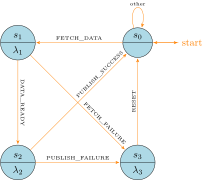

@import "table.css"

# The Producer Actor

## Definition

We can not model the producer as a Mealy machine due to the non-deterministic nature, we need state be able to emit events. This leads to the actor model, which is more suitable for the producer.

Unlike Mealy machines, which are inherently deterministic and reactive—responding strictly to external inputs—the Producer Actor requires the ability to **proactively generate events** based on internal state transitions and actions. This necessitates a model that supports **asynchronous communication**, **state encapsulation**, and **event-driven behavior**, all of which are core characteristics of the Actor Model.

Formally, the producer actor is a sextuple state machine $M=\left<Q, \Sigma, \delta, \lambda, q_0, F\right>$, where:

- $Q$: The set of states representing distinct operational modes of the producer.
- $\Sigma$: The set of possible events that the producer can handle or emit.
- $\delta$: The transition function dictating how the producer moves between states in response to events.
- $\lambda$: The action function defining the events the producer emits based on state-event pairs.
- $q_0$: The initial state where the producer awaits commands.
- $F$: The set of accepting states indicating successful operation cycles.

By convention, $\Sigma^*$ denotes the set of all finite sequences (strings) of events generated by $\Sigma$. A word $w = \sigma_1\sigma_2\ldots\sigma_n \in \Sigma^*\in\Sigma^*$ is an accepting word if, after processing the entire sequence, the system transitions into one of its accepting (final) states $F$.

This model conform to the actor model but differ from the Mealy machine in the following way:

1. Output word space $\Gamma$ is removed.
2. The running input word $\Sigma^*$ is composed of outside input word and input word that is generated from actions, both inputs conform with $\Sigma$.

This sextuple framework aligns with the Actor Model by facilitating **state encapsulation** and **event-driven message passing**. Unlike traditional automata where outputs are separate from inputs, here, the action function $\lambda$ generates new events within $\Sigma$, enabling **dynamic and asynchronous interactions** within the system.

### State space $Q$

The **state space** $Q=\{s_0,s_1,s_2,s_3\}$, where

- $s_0=\text{Idle}$: The system is idle, waiting for a `FETCH_DATA` command to initiate data retrieval.
- $s_1 = \text{FetchingData}$: The system is actively fetching data from CryptoCompare upon receiving `FETCH_DATA`.
- $s_2 = \text{Publishing}$: Once data is ready (`DATA_READY`), the system publishes the aggregated data to Kafka/Redpanda.
- $s_3 = \text{Error}$: Handles any failures during fetching or publishing, responding to `FETCH_FAILURE` or `PUBLISH_FAILURE`.

The initial state $q_0=s_0$ and the acceptor $F={s_0}$:

- **Initial State** ($s_0 = \text{Idle}$): Awaiting commands to fetch or publish data. This is also the **accepting state**, indicating that operations have successfully cycled back to an idle state.

### The input space $\Sigma$

$\Sigma=\{\sigma_1,\sigma_2,\sigma_3,\sigma_4,\sigma_5,\sigma_6\}$, where

- $\sigma_1 = FETCH\_DATA$: signal to initiate the data fetching.
- $\sigma_2 = DATA\_READY$: notification that data has been successfully fetched.
- $\sigma_3 = FETCH\_FAILURE$: notification that data fetched failed.
- $\sigma_4 = PUBLISH\_SUCCESS$: confirmation that data has been successfully published.
- $\sigma_5 = PUBLISH\_FAILURE$: notification of a failure in publishing data.
- $\sigma_6 = RESET$: signal to reset the actor from an error state.

In our platform, the elements of $\Sigma$ are termed **events**, which can originate from external user inputs or be generated internally by the actor's actions.

### The transition function $\delta$

The transition function $\delta$ defines state transitions based on incoming events. Each transition is triggered by an event, leading to a state change that may also result in generating new events through the action function $\lambda$.

**Transition function** $\delta: Q\times\Sigma\rightarrow Q$ is defined as

  

  

    

      Table 1:
      Transition function $\delta$ for producer actor - a symbolic definition:
    

| current state | event              | next state |
| ------------- | ------------------ | ---------- |
| $s_0$         | $\sigma_1$         | $s_1$      |
| $s_0$         | All other $\sigma$ | $s_0$      |
| $s_1$         | $\sigma_2$         | $s_2$      |
| $s_1$         | $\sigma_3$         | $s_3$      |
| $s_2$         | $\sigma_4$         | $s_0$      |
| $s_2$         | $\sigma_5$         | $s_3$      |
| $s_3$         | $\sigma_6$         | $s_0$      |

  

  

  

  

    

      Table 2:
      Transition function $\delta$ for producer actor - a descriptive definition:
    

| current state | event             | next state   |
| ------------- | ----------------- | ------------ |
| Idle          | if not FETCH_DATA | Idle         |
| Idle          | FETCH_DATA        | FetchingData |
| FetchingData  | DATA_READY        | Publishing   |
| FetchingData  | FETCH_FAILURE     | Error        |
| Publishing    | PUBLISH_SUCCESS   | Idle         |
| Publishing    | PUBLISH_FAILURE   | Error        |
| Error         | RESET             | Idle         |

  

  

### The action $\lambda$

The **action** (next-output function in automata) $\lambda: Q\times\Sigma\rightarrow\Sigma$: We use $\Lambda$ for the set of actions, and $\Lambda=\{\lambda_1,\lambda_2,\lambda_3,\lambda_4\}$, where

- $\lambda_1 = \text{startFetch}$: Initiates the data fetching process, leading to either a successful fetch ($\sigma_2$) or a failure ($\sigma_3$). This is the action for state $s_1$.
- $\lambda_2 = \text{startPublish}$: Initiates the data publishing process, resulting in either a successful publish ($\sigma_4$) or a failure ($\sigma_5$). This is the action for state $s_2$.
- $\lambda_3 = \text{errorHandler}$: Handles errors by emitting a reset event ($\sigma_6$) to revert the system to the Idle state. This is the action for state $s_3$.

  

    Table 3:
      The next-output function $\lambda$ for producer actor - a symbolic definition:
  

| current state | event      | $\lambda\in\Lambda$ | output                   |
| ------------- | ---------- | ------------------- | ------------------------ |
| $s_1$         | $\sigma_1$ | $\lambda_1$         | $\sigma_2$ or $\sigma_3$ |
| $s_2$         | $\sigma_2$ | $\lambda_2$         | $\sigma_4$ or $\sigma_5$ |
| $s_3$         | $\sigma_3$ | $\lambda_3$         | $\sigma_6$               |
| $s_3$         | $\sigma_5$ | $\lambda_3$         | $\sigma_6$               |

  

  

    Table 4:
      Descriptive Output Function $\lambda $
  

| Current State | Input Event     | Action       | Output                            |
| ------------- | --------------- | ------------ | --------------------------------- |
| FetchingData  | FETCH_DATA      | startFetch   | DATA_READY / FETCH_FAILURE        |
| Publishing    | DATA_READY      | startPublish | PUBLISH_SUCCESS / PUBLISH_FAILURE |
| Error         | FETCH_FAILURE   | errorHandler | RESET                             |
| Error         | PUBLISH_FAILURE | errorHandler | RESET                             |

  

## Diagram

## Simulation

The transition function $\delta$ is extended inductively into $\bar\delta: Q\times\Sigma^*\rightarrow Q$ to describe the machine's behavior when fed whole input words. For the empty string $\varepsilon$, $\bar\delta(q,\varepsilon)=q$ for all states $q$, and for strings $wa$ where $a$ is the last symbol and $w$ is the (possibly empty) rest of the string, $\bar\delta(q,wa)=\delta(\bar\delta(q,w),a)$. The output function $\lambda$ may be extended similarly into $\bar\lambda(q,w)$, which gives the complete output of the machine when run on word $w$ from state $q$.

This allows the following to be defined:

### Accepting word

A word $w=a_1a_2,\ldots a_n\in\Sigma^*$ is an accepting word for the automaton if $\bar\delta(q_0,w)\in F$, that is, if after consuming the whole string $w$ the machine is in an accept state.

### Recognized language

The language $L\subseteq\Sigma^*$ _recognized_ by a machine is the set of all the words that are accepted by the machine, $L=\{w\in\Sigma^*\mid\bar\delta(q_0,w)\in F\}$.

### Simulation 1: Successful Data Fetch and Publish

- **Input Sequence:** $w = \sigma_1 \sigma_2 \sigma_4$
- **Step-by-Step Execution:**
  1. **Initial State:** $s_0$ (Idle)
  2. **Event** $\sigma_1$ (FETCH_DATA):
     - Transition: $s_0 \rightarrow s_1$
     - Action: startFetch
     - Output: $\sigma_2$ (DATA_READY)
  3. **Event** $\sigma_2$ (DATA_READY):
     - Transition: $s_1 \rightarrow s_2$
     - Action: completeFetch
     - Output: $\sigma_4$ (PUBLISH_SUCCESS)
  4. **Event** $\sigma_4$ (PUBLISH_SUCCESS):
     - Transition: $s_2 \rightarrow s_0$
     - Action: completePublish
     - Output: Idle state confirmed
  - **Final State:** $s_0$ (Idle) is an accepting state.
  - **Result:** $w$ is an accepting word.

### Simulation 2: Data Fetch Failure

- **Input Sequence:** $w' = \sigma_1 \sigma_3 \sigma_6$
- **Step-by-Step Execution:**
  1. **Initial State:** $s_0$ (Idle)
  2. **Event** $\sigma_1$ (FETCH_DATA):
     - Transition: $s_0 \rightarrow s_1$
     - Action: startFetch
     - Output: $\sigma_2$ (DATA_READY) or $\sigma_3$ (FETCH_FAILURE)
  3. **Event** $\sigma_3 $ (FETCH_FAILURE):
     - Transition: $s_1 \rightarrow s_3$
     - Action: handleFetchError
     - Output: $\sigma_6$ (RESET)
  4. **Event** $\sigma_6$ (RESET):
     - Transition: $s_3 \rightarrow s_0$
     - Action: resetFromError
     - Output: $\sigma_6$ (RESET)
  - **Final State:** $s_0$ (Idle) is an accepting state.
  - **Result:** $w'$ is an accepting word despite the failure, indicating a potential need to revisit acceptance criteria.

### Simulation 3: Multiple Fetch and Publish Cycles with an Error

- **Input Sequence:** $w'' = \sigma_1 \sigma_2 \sigma_1 \sigma_3 \sigma_6$

  **Step-by-Step Execution:**

  1. $s_0$ (Idle) receives $\sigma_1$ (FETCH_DATA):

     - Transition: $s_0 \rightarrow s_1$
     - Action: $\lambda_1$ (startFetch)
     - Output: Emits $\sigma_2$ (DATA_READY)

  2. $s_1$ (FetchingData) receives $\sigma_2$ (DATA_READY):

     - Transition: $s_1 \rightarrow s_2$
     - Action: $\lambda_2$ (startPublish)
     - Output: Emits $\sigma_4$ (PUBLISH_SUCCESS)

  3. $s_2$ (Publishing) receives $\sigma_1$ (FETCH_DATA):

     - Per Table 1: $\sigma_1$ is not $\sigma_4$ or $\sigma_5$ for $s_2$, so assuming $s_2$ remains to handle current publish, or define additional transitions.
     - If undefined: Assuming other events lead to state staying or ignoring.

  4. $s_1$ (FetchingData) receives $\sigma_3$ (FETCH_FAILURE):

     - Transition: $s_1 \rightarrow s_3$
     - Action: $\lambda_3$ (errorHandler)
     - Output: Emits $\sigma_6$ (RESET)

  5. $s_3$ (Error) receives $\sigma_6$ (RESET):
     - Transition: $s_3 \rightarrow s_0$
     - Action: $\lambda_6$ (resetErrors)
     - Output: Emits no further events.

  - **Final State:** $s_0$ (Idle), an accepting state.

  **Result:** $w''$ is an accepting word, even though a fetch failure occurred, again highlighting the need to reconsider acceptance criteria.
